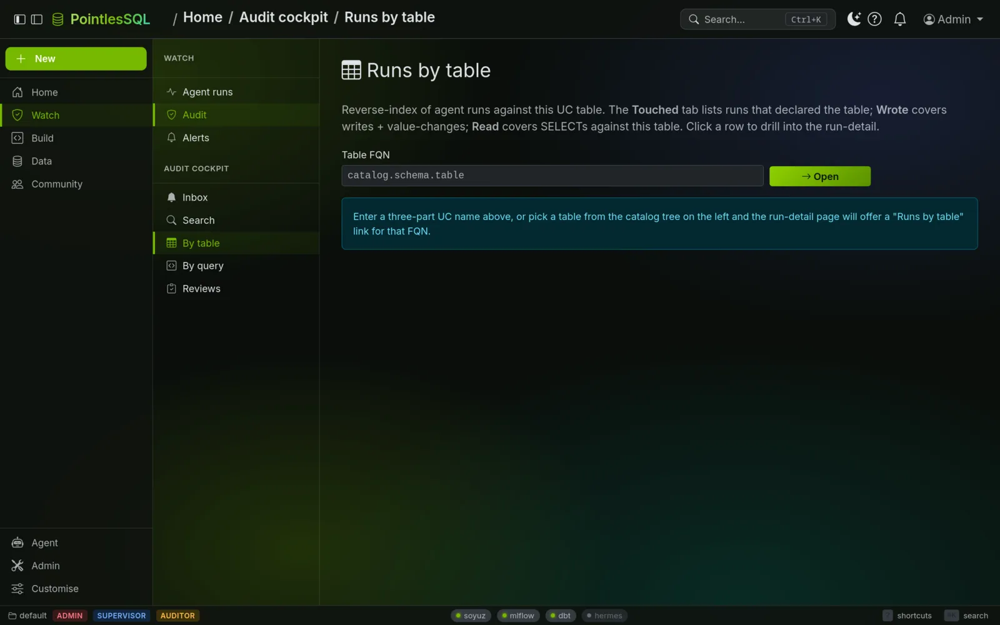
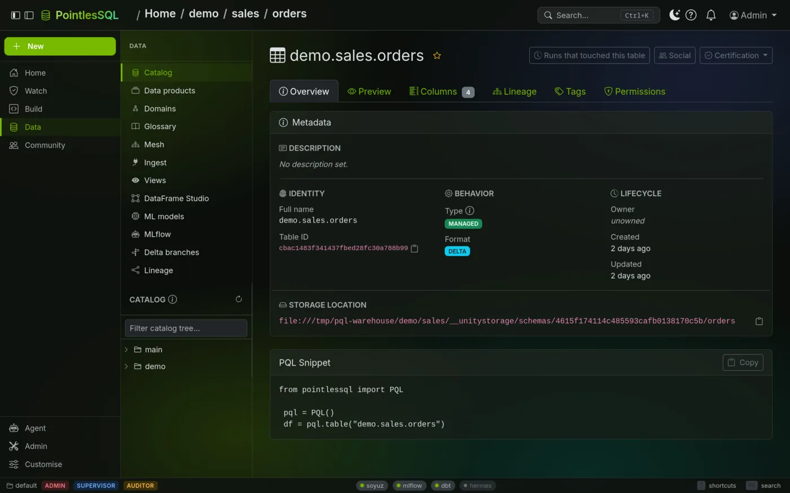
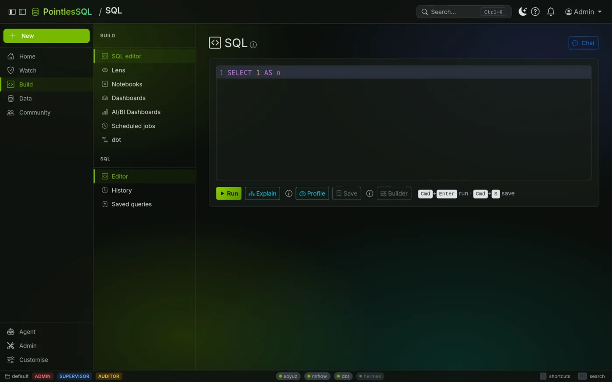
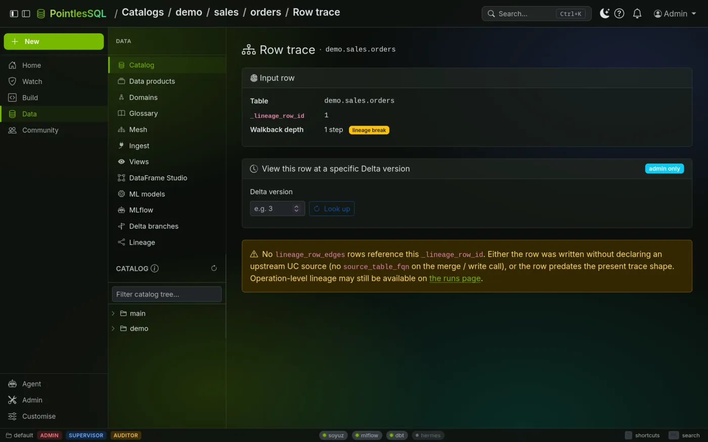
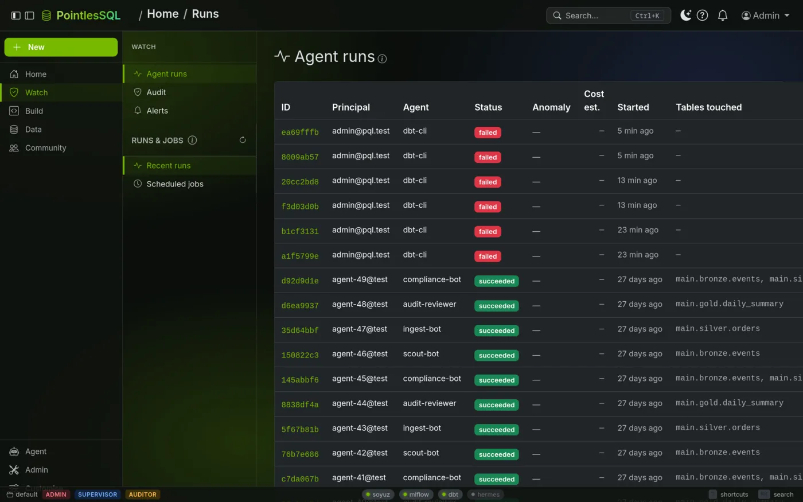
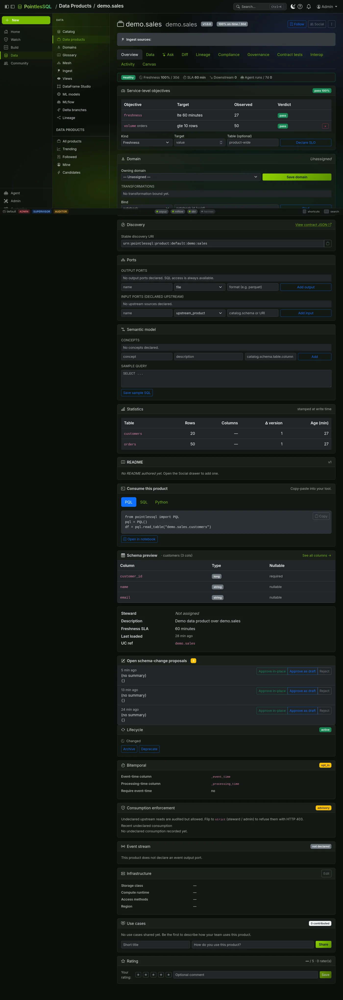
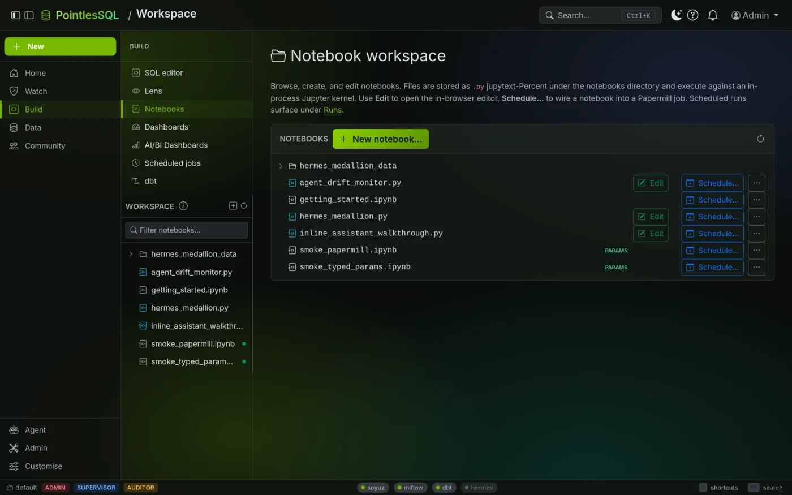
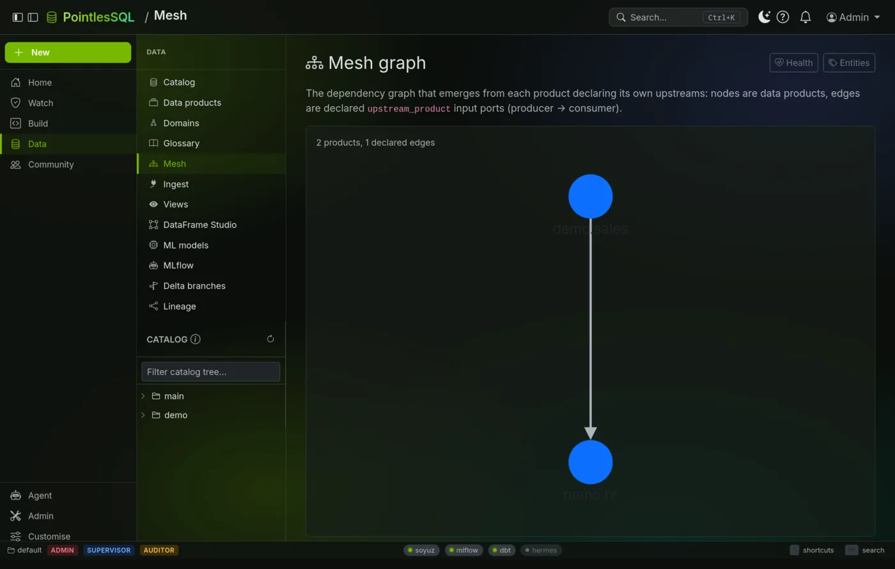
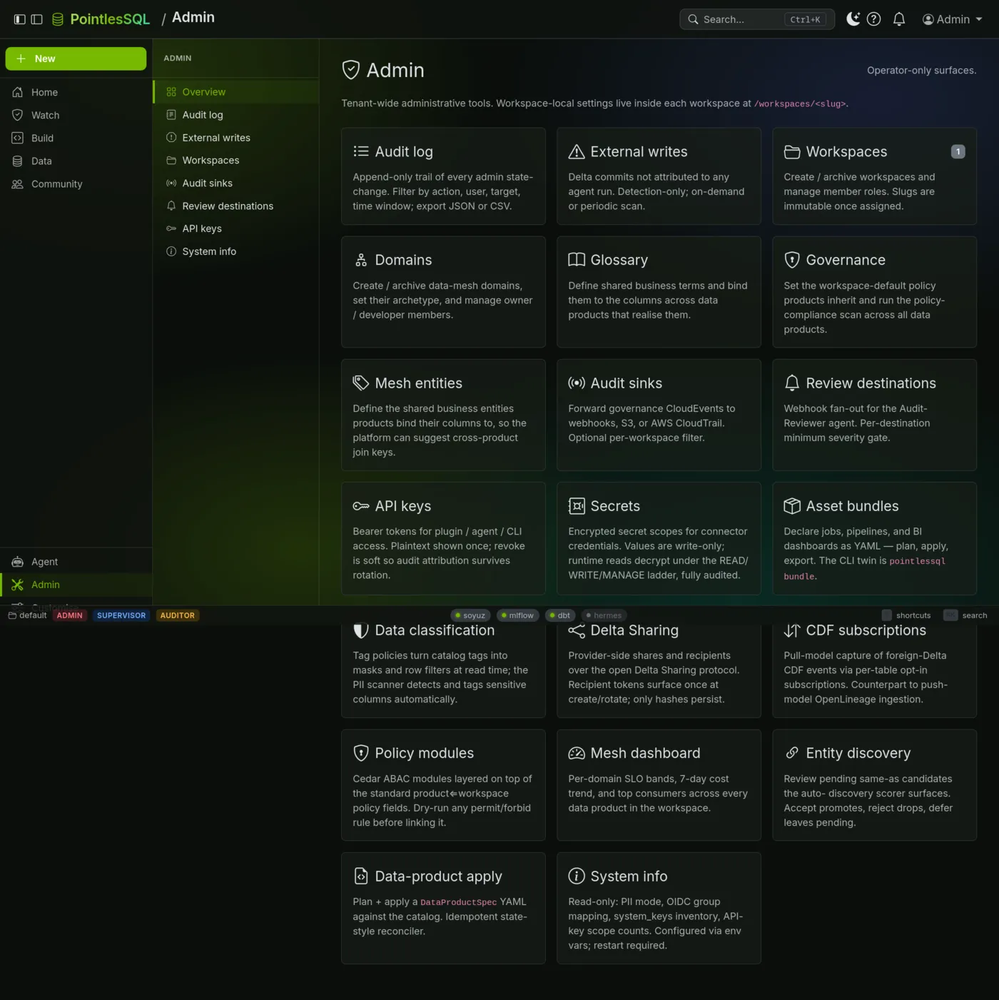
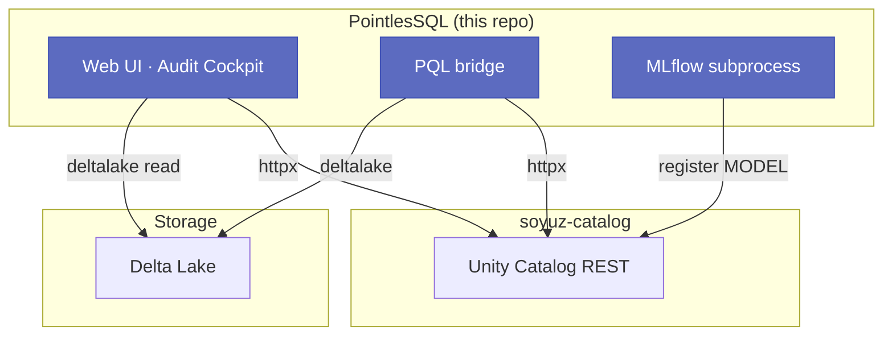

<div align="center">

<a href="docs/assets/trailer.mp4">
  
</a>

<h1>PointlesSQL</h1>

<p><strong>The per-cell auditable lakehouse for agent-driven data engineering — EU-AI-Act-native.</strong></p>

<p>
A web UI and Python bridge over
<a href="https://github.com/FloHofstetter/soyuz-catalog">soyuz-catalog</a>
(Unity&nbsp;Catalog&nbsp;REST), Delta&nbsp;Lake, and MLflow — with a forced audit
trail every agent action falls into, at the <strong>row, column, and value</strong> level.
</p>

<p>
▶ <a href="docs/assets/trailer.mp4"><strong>Watch the full trailer</strong></a>
&nbsp;·&nbsp; <a href="docs/">Documentation</a>
&nbsp;·&nbsp; <a href="#quick-start-docker">Quick start</a>
&nbsp;·&nbsp; <a href="ROADMAP.md">Roadmap</a>
</p>

<p>
<a href="https://github.com/FloHofstetter/PointlesSQL/actions/workflows/test.yml"></a>

<a href="LICENSE"></a>
<a href="https://github.com/FloHofstetter/PointlesSQL/pkgs/container/pointlessql"></a>
<a href="docs/"></a>

</p>

</div>

---

## Table of contents

- [Why PointlesSQL](#why-pointlessql)
- [Screenshots](#screenshots)
- [Features](#features)
- [Quick start (Docker)](#quick-start-docker)
- [Quick start (local development)](#quick-start-local-development)
- [Using PQL](#using-pql)
- [Architecture](#architecture)
- [Configuration](#configuration)
- [Jobs & scheduling](#jobs--scheduling)
- [Documentation](#documentation)
- [Contributing](#contributing)
- [Security](#security)
- [License](#license)

## Why PointlesSQL

The EU AI Act (Article 12), SOC 2, and GDPR all require verifiable audit
trails for data work performed by automated systems. Agents writing
notebooks today leave no per-row, per-column, per-value lineage — when an
auditor or incident-responder asks *"which agent run produced this value,
from which inputs, using which prompt and model?"*, the answer has to be
reconstructed by hand from logs that were never designed to carry that
semantic load.

PointlesSQL closes that gap **as part of the runtime, not as an add-on
observability layer**:

- **Forced audit trail** at row, column, and value level — every PQL write,
  merge, branch, rollback, and read lands in `agent_run_operations`
  automatically. Opt-out is a deliberate config decision, not the default.
- **Branch isolation per agent run** — Delta-Lake-native shallow clones let
  each agent run write to an isolated branch that promotes via human review.
- **First-class rollback** — `pql.rollback(run_id)` is a supervised action
  with cryptographic preview, not a manual Delta `RESTORE` ritual.
- **Review-bot infrastructure** — the same audit primitives feed a daily
  Audit-Reviewer, a Compliance-Bot, and an Incident-Responder agent, so the
  trail becomes actionable rather than just stored.

PointlesSQL doesn't replace your query engine, your catalog, or your agent
framework — it composes them under a forced-audit contract.

## Screenshots

<p align="center">
  <a href="docs/assets/screenshots/audit-cockpit.webp"></a>
  <br>
  <sub><b>Audit Cockpit</b> — every agent write, merge, branch, and rollback, traceable by table, row, column, and value.</sub>
</p>

<table>
  <tr>
    <td width="50%">
      <a href="docs/assets/screenshots/catalog.webp"></a>
      <br><sub><b>Catalog & table metadata</b> — browse catalogs → schemas → tables with inline comment/property edits.</sub>
    </td>
    <td width="50%">
      <a href="docs/assets/screenshots/sql-editor.webp"></a>
      <br><sub><b>SQL editor</b> — typed autocomplete, query profile, and a DBX-compatible statement API.</sub>
    </td>
  </tr>
  <tr>
    <td>
      <a href="docs/assets/screenshots/row-lineage-trace.webp"></a>
      <br><sub><b>Per-row lineage</b> — trace any value back to the run, its inputs, prompt, and model.</sub>
    </td>
    <td>
      <a href="docs/assets/screenshots/runs.webp"></a>
      <br><sub><b>Agent runs</b> — run history with per-run diff, status, and promote/discard control.</sub>
    </td>
  </tr>
  <tr>
    <td>
      <a href="docs/assets/screenshots/data-products.webp"></a>
      <br><sub><b>Data products & mesh</b> — contracts, governance, and a canvas builder over the catalog.</sub>
    </td>
    <td>
      <a href="docs/assets/screenshots/notebook.webp"></a>
      <br><sub><b>Native notebooks</b> — pyright LSP, per-notebook ipykernel, real-time CRDT co-edit.</sub>
    </td>
  </tr>
</table>

<details>
<summary>More screenshots</summary>

<table>
  <tr>
    <td width="50%"><a href="docs/assets/screenshots/data-mesh.webp"></a><br><sub><b>Data mesh</b></sub></td>
    <td width="50%"><a href="docs/assets/screenshots/admin.webp"></a><br><sub><b>Admin console</b></sub></td>
  </tr>
</table>

</details>

## Features

A production stack with the following surfaces shipped:

- **Catalog browser** — catalogs → schemas → tables → columns with inline
  metadata edits.
- **PQL library** — `from pointlessql import PQL` — read / write / merge /
  branch / rollback Delta tables by Unity Catalog name.
- **Audit Cockpit** — `agent_run_operations` with row-, column-, value-, and
  inference-level lineage.
- **Native notebook editor** — pyright LSP, per-notebook ipykernel, and
  real-time CRDT-based multi-tab co-edit.
- **MLflow registry surface** — champion/challenger promotion and forced
  autolog training audit.
- **Delta branching** — shallow-clone branches per agent run with a control
  room for promote / discard / preview.
- **External SQL API** — DBX-compatible `/api/2.0/sql/statements` with
  per-API-key catalog + IP ACLs and usage aggregation.
- **Audit-Reviewer agents** — three personas (daily reviewer, compliance bot,
  incident responder) backed by the same audit primitives.

See [`ROADMAP.md`](ROADMAP.md) for per-sprint detail and
[`CHANGELOG.md`](CHANGELOG.md) for release notes. The
[concepts overview](docs/getting-started/concepts.md)
is the ten-minute read that links the pieces together.

## Quick start (Docker)

Two commands — no GitHub account, no local build:

```bash
curl -fsSL https://raw.githubusercontent.com/FloHofstetter/PointlesSQL/main/docker/docker-compose.yml -o docker-compose.yml
docker compose up -d
```

Both images pull from GHCR — no source checkout, no `docker login`:

- **PointlesSQL** on <http://localhost:8000>
- **soyuz-catalog** Unity Catalog API on <http://localhost:8080>

Pin a specific release with the `PQL_VERSION` / `SOYUZ_VERSION` environment
variables; the defaults track the latest published images. Delta tables and
notebooks live in named Docker volumes that survive `docker compose down`.
See
[`docs/getting-started/installation.md`](docs/getting-started/installation.md)
for production pinning, the Grafana audit overlay, and troubleshooting.

## Quick start (local development)

Source-checkout flow for contributors. See
[`docs/getting-started/installation.md`](docs/getting-started/installation.md)
for the full three-flavour guide.

**1. Start soyuz-catalog:**

```bash
git clone https://github.com/FloHofstetter/soyuz-catalog.git ~/git/soyuz-catalog
cd ~/git/soyuz-catalog
uv sync
uv run soyuz-catalog        # listening on http://127.0.0.1:8080
```

**2. Start PointlesSQL:**

```bash
git clone https://github.com/FloHofstetter/PointlesSQL.git ~/git/PointlesSQL
cd ~/git/PointlesSQL
uv sync
uv run pointlessql          # listening on http://127.0.0.1:8000
```

`uv sync` fetches the `soyuz-catalog-client` wheel from the public pin in
`pyproject.toml` — no credentials required. If you want edits to
`../soyuz-catalog` to surface without bumping the pin,
`bash scripts/use-editable-soyuz.sh` swaps to the sibling checkout.

**3. Browse the catalog:** open <http://127.0.0.1:8000>. The sidebar lists
every catalog, schema, and table from soyuz-catalog; click through to see
column schemas and edit comments and properties inline.

## Using PQL

PQL bridges Unity Catalog metadata and Delta Lake DataFrames. Use it from the
built-in **Notebook** editor or any Python process:

```python
from pointlessql import PQL

pql = PQL()

# List what's in the catalog
pql.list_catalogs()

# Read a Delta table as a pandas DataFrame
df = pql.table("my_catalog.my_schema.my_table")

# Write a DataFrame back as a new table
import pandas as pd
df = pd.DataFrame({"id": [1, 2, 3], "value": [10.5, 20.0, 30.7]})
pql.write_table(df, "my_catalog.my_schema.new_table")

# Every write is recorded; supervised rollback by run id
pql.rollback(run_id)
```

New tables appear immediately in the sidebar. The notebook editor speaks
**jupytext `.py` percent-format**; convert an existing `.ipynb` with
`jupytext --to py:percent notebook.ipynb`.

## Architecture



PointlesSQL and soyuz-catalog are **separate processes**. PointlesSQL imports
the typed client library and talks to soyuz-catalog over HTTP — no shared
Python state, no shared database.

**Built on:** [soyuz-catalog](https://github.com/FloHofstetter/soyuz-catalog)
(Unity Catalog REST), [Delta Lake](https://delta.io/),
[MLflow](https://mlflow.org/), FastAPI, and the
`deltalake` + `pandas` + `polars` + `duckdb` stack.

## Configuration

PointlesSQL is configured via environment variables. Every variable follows
the `POINTLESSQL_<SUBMODEL>_<FIELD>` pattern; see `.env.example` for the full
list.

| Variable | Default | Description |
|---|---|---|
| `POINTLESSQL_SOYUZ_CATALOG_URL` | `http://127.0.0.1:8080` | soyuz-catalog server URL |
| `POINTLESSQL_SERVER_HOST` | `127.0.0.1` | Bind address (`0.0.0.0` in Docker) |
| `POINTLESSQL_SERVER_PORT` | `8000` | HTTP port |
| `POINTLESSQL_DB_URL` | `sqlite:///./pointlessql.db` | SQLAlchemy database URL |
| `POINTLESSQL_AUTH_SECRET_KEY` | `change-me-in-production` | JWT signing key |

## Jobs & scheduling

PointlesSQL includes an in-process scheduler that runs multi-task DAGs on a
cron schedule. Two job kinds ship out of the box: `pg_sync` (the
Postgres-to-UC mirror) and `python` (an entry-point loader for user-authored
executors). See [`docs/guides/jobs.md`](docs/guides/jobs.md) for how to author
a custom job kind, the executor signature, the optional failure webhook, and a
worked example that uses `pql` inside a task.

Prometheus metrics are exposed at `GET /metrics` (admin-only).

## Documentation

- **Browse in-repo:** the full docs tree lives under [`docs/`](docs/) and
  renders directly on GitHub.
- **Local site:** `uv run --group docs --no-default-groups mkdocs serve`,
  then open <http://127.0.0.1:8000>. A hosted docs site follows shortly
  after launch.
- **Concepts:** the
  [concepts overview](docs/getting-started/concepts.md)
  links the audit trail, lineage, branching, and agent-supervision pieces.

## Contributing

PRs welcome. See [`CONTRIBUTING.md`](CONTRIBUTING.md) for the development
environment, local gates, and PR conventions. Bugs and feature requests go
through GitHub Issues (pick the right template from the *New Issue* picker).

## Security

Vulnerabilities should be reported privately. See [`SECURITY.md`](SECURITY.md)
for the responsible-disclosure path.

## License

Apache-2.0. See [`LICENSE`](LICENSE) and [`NOTICE.txt`](NOTICE.txt).
