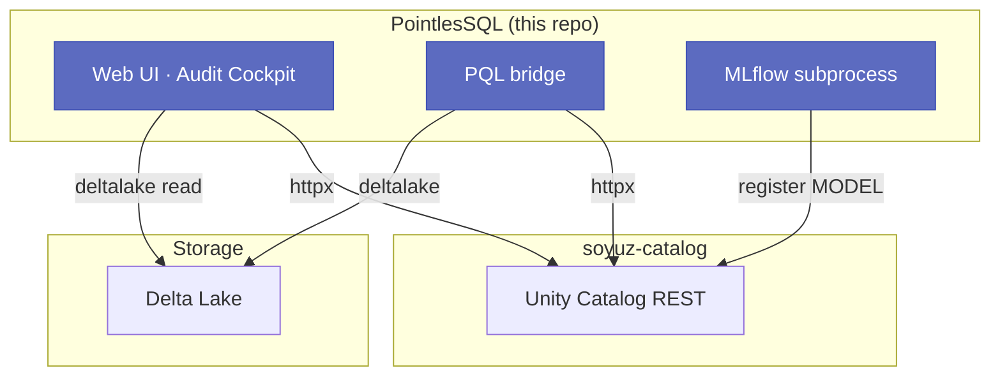

# PointlesSQL

**Databricks-shaped, Python-only, agent-native.**
A web UI and Python bridge over
[soyuz-catalog](https://github.com/FloHofstetter/soyuz-catalog)
(Unity-Catalog REST), Delta Lake, and MLflow — with a forced
audit trail every agent action falls into.

📚 **Documentation**: run `uv run mkdocs serve` and open
<http://127.0.0.1:8000>.  The docs site goes public as part of
the launch sprint; until then, browse the markdown source under
[`docs/`](docs/).

## Status

Phase 21 (audit-first ML registry) closed 2026-04-30.  The stack
ships:

- **Catalog browser** with inline metadata edit
- **PQL library** — `from pointlessql import PQL` — read / write
  / merge / branch / rollback Delta tables by UC name
- **Audit Cockpit** — `agent_run_operations` with row, column,
  value, and inference-level lineage
- **Native notebook editor** with pyright LSP and per-notebook
  ipykernel
- **MLflow registry surface** with champion/challenger promotion
  and forced-autolog training audit

See [`ROADMAP.md`](ROADMAP.md) for the per-sprint detail and
[`CHANGELOG.md`](CHANGELOG.md) for release notes.  The
[concepts overview](docs/getting-started/concepts.md) is the
ten-minute read that links the pieces together.

## Stack

- **Python 3.14**, managed with [`uv`](https://docs.astral.sh/uv/)
- **FastAPI + Uvicorn**, Jinja2 + Bootstrap 5.3 + HTMX + Alpine
- **`soyuz-catalog-client`** — typed httpx wrapper for UC REST
- **`deltalake` + `pandas` + `polars` + `duckdb`** — PQL bridge
- **`jupyter_client` + `ipykernel` + `pyright` + `jupytext`** —
  notebook editor
- **SQLAlchemy 2.0 + Alembic** — own metadata DB (sessions, UI
  preferences, audit trail); soyuz-catalog owns the lakehouse
  metadata
- **`mlflow`** — registry subprocess (Phase 21)
- **pytest + ruff + pyright + pydoclint + pre-commit**

## Architecture



PointlesSQL and soyuz-catalog are **separate processes**.
PointlesSQL imports the typed client library and talks to
soyuz-catalog over HTTP — no shared Python state, no shared
database.

## Quick start (Docker + GHCR images)

Zero-build install — both images pull from GHCR. No source
checkout required. Full detail including PAT-creation and
troubleshooting in [`docs/getting-started/installation.md`](docs/getting-started/installation.md).

**1. Log in to GHCR** with a classic PAT that has `read:packages`:

```bash
echo "$GHCR_PAT" | docker login ghcr.io -u <your-github-username> --password-stdin
```

**2. Download the reference compose file into a fresh directory:**

```bash
mkdir ~/pointlessql && cd ~/pointlessql
curl -L -o docker-compose.yml \
  https://raw.githubusercontent.com/FloHofstetter/PointlesSQL/v0.1.0rc3/docker-compose.yml
```

**3. Flip both services from `build:` to `image:`** — in each
service comment out the `build:` block and uncomment the `image:`
line directly above it. See [`docs/getting-started/installation.md`](docs/getting-started/installation.md)
for the exact two-line edit.

**4. Pull and start:**

```bash
docker compose pull
docker compose up -d
```

- **soyuz-catalog** on <http://localhost:8080>
- **PointlesSQL** on <http://localhost:8000>

Delta tables are stored in `./warehouse/` (bind-mounted into both
containers). Notebooks are stored in `./notebooks/` as
``.py`` jupytext Percent-format files (Sprint 63 retired the
JupyterLab iframe; see the [migration note](#migrating-from-the-jupyterlab-iframe-sprint-63)).

## Quick start (local development)

Source-checkout flow for contributors. See
[`docs/getting-started/installation.md`](docs/getting-started/installation.md) for the full three-flavour
guide.

**1. Start soyuz-catalog:**

```bash
git clone git@github.com:FloHofstetter/soyuz-catalog.git ~/git/soyuz-catalog
cd ~/git/soyuz-catalog
uv sync
uv run soyuz-catalog
# listening on http://127.0.0.1:8080
```

**2. Start PointlesSQL:**

```bash
git clone git@github.com:FloHofstetter/PointlesSQL.git ~/git/PointlesSQL
cd ~/git/PointlesSQL
uv sync
uv run pointlessql
# listening on http://127.0.0.1:8000
```

`uv sync` fetches the private `soyuz-catalog-client` wheel at the
pinned git tag using your shell's existing git credentials — an
ssh key against `git@github.com` is the simplest setup. If you
want edits to `../soyuz-catalog` to surface without a tag bump,
`bash scripts/use-editable-soyuz.sh` swaps the pin to the sibling
checkout.

**3. Browse the catalog:**

Open <http://127.0.0.1:8000> in a browser. The sidebar shows all
catalogs, schemas, and tables from soyuz-catalog. Click through
to see metadata, column schemas, and edit comments and properties
inline.

**4. Use PQL in the notebook:**

Click the **Notebook** tab in the navbar.  The native Monaco-based
editor (Phase 12.6) opens at ``notebooks/scratch.py``.  In a new
code cell:

```python
from pointlessql import PQL

pql = PQL()

# List what's in the catalog
pql.list_catalogs()

# Read a Delta table as a DataFrame
df = pql.table("my_catalog.my_schema.my_table")

# Write a DataFrame back as a new table
import pandas as pd
df = pd.DataFrame({"id": [1, 2, 3], "value": [10.5, 20.0, 30.7]})
pql.write_table(df, "my_catalog.my_schema.new_table")
```

New tables appear immediately in the sidebar.

## Migrating from the JupyterLab iframe (Sprint 63)

Phase 12.6 Sprint 63 retired the embedded JupyterLab subprocess
that Sprint 3 set up.  The native editor that replaced it supports
**``.py`` jupytext Percent-format notebooks only** — papermill-
generated ``.ipynb`` files under ``notebooks/runs/`` continue to
work as run artefacts and the workspace browser still lists
``.ipynb`` uploads for scheduling.

If you have hand-authored ``.ipynb`` files you want to keep editing:

```bash
jupytext --to py:percent notebooks/my_notebook.ipynb
```

This produces ``notebooks/my_notebook.py``; the editor picks it up
on open and assigns UUIDs to every cell on first save (ADR 0001 in
``docs/decisions/0001-notebook-editor.md`` explains the ``pql_cell_id``
marker format).

The ``jupyterlab`` pypi dep is gone, ``POINTLESSQL_JUPYTER_PORT``
is no longer listened on (the setting stays for backward-compat but
does nothing), the ``/notebook`` URL now 302-redirects to
``/notebook/editor?path=scratch.py``, and the job-detail page's
``Open in JupyterLab`` deep-link became a ``Download ipynb``
button.

## Development

```bash
uv run pre-commit install    # one-time: arm git hook
uv run pytest                # unit tests
uv run pytest -m integration # integration tests (needs live soyuz)
uv run ruff check            # lint
uv run pyright               # type-check
uv run pre-commit run -a     # all hooks
```

If `uv sync` fails to fetch `soyuz-catalog-client`, confirm your
shell has git credentials for the private soyuz-catalog repo (an
ssh key against `github.com`, or a classic PAT wired through
`git config --global url.insteadOf`). See
[`docs/getting-started/installation.md`](docs/getting-started/installation.md) Troubleshooting for the full
checklist.

## Configuration

PointlesSQL is configured via environment variables:

Sprint 45 split the flat `Settings` into nine sub-models with
per-sub-model `env_prefix`. Every variable below follows the
`POINTLESSQL_<SUBMODEL>_<FIELD>` pattern; see `.env.example` for
the full list and `CHANGELOG.md` for the Sprint-45 rename map.

| Variable | Default | Description |
|---|---|---|
| `POINTLESSQL_SOYUZ_CATALOG_URL` | `http://127.0.0.1:8080` | soyuz-catalog server URL |
| `POINTLESSQL_SERVER_HOST` | `127.0.0.1` | Bind address (`0.0.0.0` in Docker) |
| `POINTLESSQL_SERVER_PORT` | `8000` | HTTP port |
| `POINTLESSQL_DB_URL` | `sqlite:///./pointlessql.db` | SQLAlchemy database URL |
| `POINTLESSQL_AUTH_SECRET_KEY` | `change-me-in-production` | JWT signing key |
| `POINTLESSQL_JUPYTER_ENABLED` | `true` | Enable embedded JupyterLab |
| `POINTLESSQL_JUPYTER_PORT` | `8888` | JupyterLab port |

## Jobs

PointlesSQL includes an in-process scheduler that can run multi-task
DAGs on a cron schedule. Two job kinds ship out of the box:
`pg_sync` (the Postgres-to-UC mirror) and `python` (an entry-point
loader for user-authored executors). See
[`docs/guides/jobs.md`](docs/guides/jobs.md) for how to author a custom job kind,
the executor signature, the optional failure webhook, and a worked
example that uses `pql` inside a task.

Prometheus metrics are exposed at `GET /metrics` (admin-only).

## Relationship to other repos

- [`soyuz-catalog`](https://github.com/FloHofstetter/soyuz-catalog)
  -- the UC REST server PointlesSQL talks to
- `~/git/delta` -- Delta Lake Python bindings
- `~/git/unitycatalog` -- upstream JVM reference (kept for spec
  contracts only)
- `~/git/spark` -- optional; relevant once PointlesSQL grows into
  query execution

## License

Apache-2.0. See [`LICENSE`](LICENSE).
