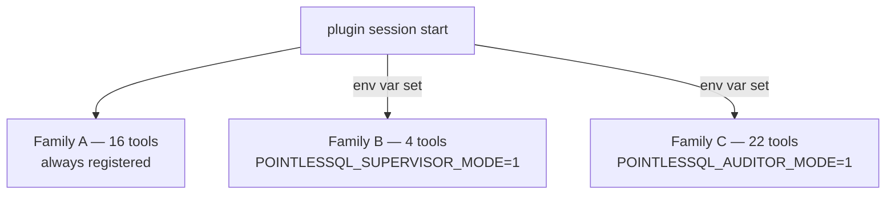
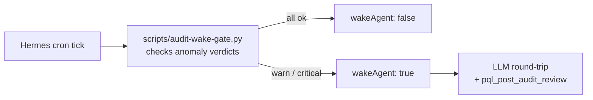
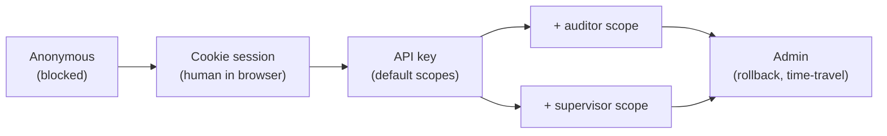

# Agent supervision

PointlesSQL is **not** a hands-off platform. It is built around
the assumption that an autonomous agent will occasionally do the
wrong thing, and the *system* should catch it — not the human
that happens to be online.

This page explains the supervision architecture: three privilege
families, two scope dimensions, the daily review loop, the
agent_reviews persistence layer, and the four canonical bot
personas.

> **See also**: [Agent memory](agent-memory.md) frames the same
> per-operation audit log as the agent's persistent memory,
> exposes it via `pql.memory.record/recall/branch/replay/fork`,
> and explains the Delta-vs-Lakebase positioning.

## The three privilege families

Every Hermes plugin tool falls into one of three families:

| Family | Scope | Examples | Gate |
|---|---|---|---|
| **A — Always-on** | Read-only or audit-additive | `pql_list_tables`, `pql_get_run`, `pql_log_training_run` | None |
| **B — Supervisor-gated** | Mutating + visible decisions | `pql_promote_model`, `pql_rollback`, `pql_post_audit_review` | `POINTLESSQL_SUPERVISOR_MODE=1` env + supervisor scope on the API key |
| **C — Auditor-only** | Read-only deep audit access | `pql_query_value_changes`, `pql_query_external_writes`, `pql_query_rejects`, 6 more | `POINTLESSQL_AUDITOR_MODE=1` env + auditor scope on the API key |

Family B and C are **registered conditionally** by the plugin at
session start. An agent without the env-var set never sees the
tool in its tool list — the LLM cannot call what it cannot see.



The plugin's
[`tools/__init__.py`](https://github.com/FloHofstetter/hermes-plugin-pointlessql/blob/main/hermes_plugin_pointlessql/tools/__init__.py)
implements the gating. Server-side, `require_supervisor` /
`require_auditor` dependencies still re-check the API key scope
— the env-var gate is belt-and-braces.

## Two scope dimensions

API keys have **two independent scope flags** beyond the base
"can call PointlesSQL at all":

| Flag | Default | Allows |
|---|---|---|
| `supervisor` | false | Family-B tools (writes that need decisions) |
| `auditor` | false | Family-C tools (read-only audit-cockpit endpoints) |

The two dimensions are **asymmetric**: an auditor key passes
`require_supervisor` checks too (auditors can write reviews),
but a supervisor key does not pass `require_auditor` (a model-
promotion-bot has no business reading value-changes).

This split is deliberate. The **daily Audit-Reviewer-Bot** runs
with auditor scope and writes its review back via
`pql_post_audit_review` — that's a write, but it's an audit-
additive write, so the auditor scope alone is enough. A
**model-promotion bot** runs with supervisor scope but auditor
off — it doesn't need to see PII-tagged value-changes to flip a
champion marker.

## Wake-gate optimisation

Most agent runs don't need an LLM. PointlesSQL ships a
**wake-gate** pre-fetch that runs *before* the LLM round-trip:



The script reads the same `/api/audit/<axis>` endpoints the
plugin exposes, runs the same anomaly checks, and decides
whether the agent needs to wake up at all. On `ok` days the
LLM is skipped entirely — the cron job is essentially free.
On `warn` / `critical` days the LLM gets the verdicts as a
pre-fetched context block and goes straight to drafting the
markdown digest.

This pattern keeps the cost per agent run bounded: a year of
daily reviews costs ~5 LLM calls, not 365. See
[`scripts/audit-wake-gate.py`](https://github.com/FloHofstetter/PointlesSQL/blob/main/scripts/audit-wake-gate.py).

## The agent_reviews table

When an agent posts a review (daily digest, model-promotion
decision, incident-response writeup), it lands in
`agent_reviews`:

| Column | Notes |
|---|---|
| `id` | PK |
| `run_id` | the agent run that produced the review (FK; null for cross-run reviews) |
| `kind` | `daily_audit`, `model_promotion`, `incident_response`, `compliance_query`,... |
| `period_start` / `period_end` | review window |
| `severity` | `info`, `warn`, `critical` |
| `summary_md` | markdown body — primary surface |
| `payload_json` | structured supplement (verdicts, links, model_uri, run_id) |
| `delivered_to_json` | which webhooks fired |
| `created_at` | |

The `kind` discriminator lets PointlesSQL store
**heterogeneous reviews** in one table, with a single CloudEvent
fan-out shape. + candidates (e.g. `dataset_certification`,
`model_retirement`) just add a new `kind` value with no schema
migration.

## Webhook fan-out

Every `agent_reviews` insert fires a CloudEvent 1.0 webhook
through the `review_destinations` table. Each destination has:

- `webhook_url` — POST target
- `hmac_secret` — optional HMAC-SHA-256 of the body
- `min_severity` — `info` / `warn` / `critical` filter
- `is_active` — soft-delete

Bodies are CloudEvents 1.0 envelopes:

```json
{
 "specversion": "1.0",
 "type": "pointlessql.review.created",
 "source": "/api/reviews",
 "id": "rev-2026-04-30-1",
 "time": "2026-04-30T06:00:00Z",
 "datacontenttype": "application/json",
 "data": {
 "review_id": 42,
 "kind": "daily_audit",
 "severity": "warn",
 "period_start": "...",
 "summary_md": "...",
 "run_id": null
 }
}
```

The same CloudEvent shape carries `pointlessql.rollback.executed`
() and `pointlessql.model.promoted` — one
shared envelope for every interesting state change in the
system.

## The four canonical bot personas

 designed four reference Hermes personas that exercise
the supervision surface end-to-end:

### 1. Daily Audit-Reviewer

Cron-driven (`0 6 * * *`). Reads yesterday's anomaly digest,
drafts a markdown summary if any axis is `warn` / `critical`,
posts via `pql_post_audit_review`. Wake-gate skips the LLM
entirely on `ok` days.

Manifest:
[`docs/integrations/hermes-jobs/audit-reviewer-daily.json`](../integrations/hermes-jobs/audit-reviewer-daily.json).

### 2. Compliance-Bot

Wake-on-message (Slack DM / slash-command). Read-only. Answers
ad-hoc questions like "which runs did agent X drive last quarter
on table Y?" via the auditor toolset.

Manifest:
[`docs/integrations/hermes-jobs/compliance-bot.json`](../integrations/hermes-jobs/compliance-bot.json) +
operating manual at [`compliance-bot.md`](../integrations/hermes-jobs/compliance-bot.md).

### 3. Incident-Responder

Wake-on-message with an explicit `run_id` argument. Multi-turn
drill-down for "was hat run X kaputt gemacht?" — walks failing
op → rejects → external writes → contributing agent.

Manifest:
[`docs/integrations/hermes-jobs/incident-responder.json`](../integrations/hermes-jobs/incident-responder.json) +
operating manual at [`incident-responder.md`](../integrations/hermes-jobs/incident-responder.md).

### 4. Promotion-gate

Supervisor-scoped. Receives a model-promotion request, reads
the candidate version's metrics, makes a champion / challenger
decision, fires `pql_promote_model`. CloudEvent fan-out
notifies downstream consumers (model-serving, dashboards).

(No standalone manifest yet — the
[models-promotion walkthrough](../e2e-walkthroughs/models-promotion.md)
demonstrates the manual flow that an agent would automate.)

## Trust ladder



Anonymous → blocked. A logged-in human gets the cookie path. A
plugin-driven agent gets the key path. Supervisor and auditor
are independent extensions of the key path. Admin actions
(rollback execution, time-travel reads of any past version) sit
above both.

## Why this matters

The audit trail (every PQL write produces an op-row) is *passive*
— it tells you what happened. The supervision layer is *active*
— it makes decisions about what *should* happen next:

- "Should this model become champion?" — Promotion-gate
- "Was yesterday OK?" — daily Audit-Reviewer
- "What broke this run?" — Incident-Responder
- "Can agent X see PII columns?" — auditor scope on the key

Together they form **agents reviewing agents**: a daily
unattended review loop where one agent's audit trail becomes
another agent's input. No human is in the loop on `ok` days.
On `warn` days a human reads a digest someone else drafted. Only
on `critical` days does a human get paged.

This scales linearly with the agent population — adding a 100th
agent doesn't add 100 dashboards a human has to watch. It adds
100 lines a daily-review-bot summarises into one Slack message.

## Where to read next

- [Auth](auth.md) — the API-key + supervisor / auditor scope
 mechanics
- [Audit trail](audit-trail.md) — the `agent_run_operations`
 schema the supervision endpoints read from
- [Hermes jobs index](../integrations/hermes-jobs/README.md) —
 manifests + operating manuals for the four personas
- [Audit-reviewer-daily walkthrough](../e2e-walkthroughs/audit-reviewer-daily.md)
- [Compliance-bot walkthrough](../e2e-walkthroughs/compliance-bot.md)
- [Incident-responder walkthrough](../e2e-walkthroughs/incident-responder.md)
- [Models-promotion walkthrough](../e2e-walkthroughs/models-promotion.md)
