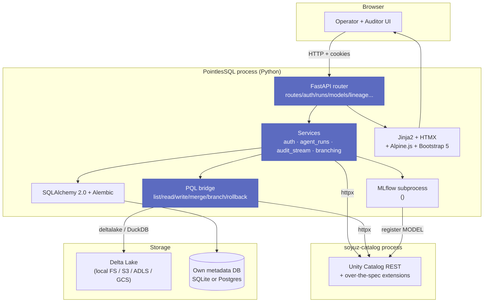
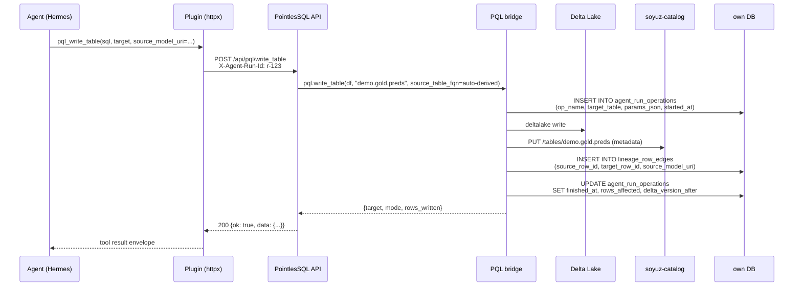
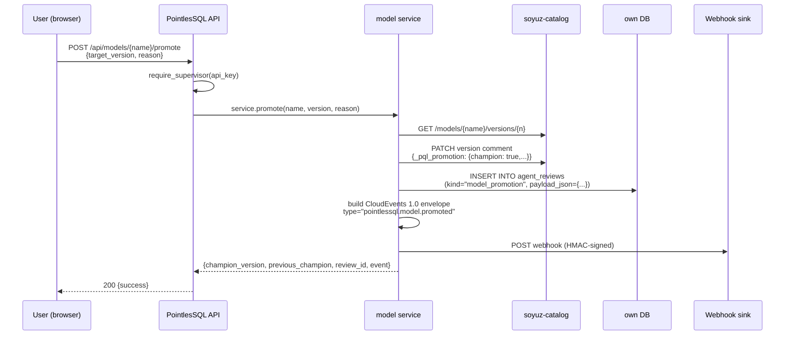

# Architecture

PointlesSQL is a thin web app + Python bridge that orchestrates
three external processes — soyuz-catalog, Delta Lake, and an
optional MLflow subprocess — and writes its own audit trail to
a small SQLAlchemy database. The boundaries between the
processes are deliberately thin so each layer stays swappable.



## The four logical layers

### 1. Routes (`pointlessql/api/`)

FastAPI declares 212 routes across 34 `*_routes.py` files.
Each route is a thin call into a service; routes never touch
SQLAlchemy or `httpx` directly. Each file groups by surface
(catalog routes, agent-run routes, model routes, lineage routes,
write routes, branch routes, audit-cockpit routes).

The **api-key middleware** (`pointlessql/api/middleware.py`)
sits in front of every route and accepts either a session cookie
or a `Bearer` API key. Cookie wins if both are present — see
[Auth](auth.md).

### 2. Services (`pointlessql/services/`)

Business logic. Each service is a Python module that:

- Owns its own SQLAlchemy queries against its tables
- Owns the `httpx` calls into soyuz-catalog or other external
 HTTP surfaces it needs
- Returns plain Python types — no FastAPI imports

The largest services are
[`agent_runs/`](https://github.com/FloHofstetter/PointlesSQL/tree/main/pointlessql/services/agent_runs),
[`audit_stream/`](https://github.com/FloHofstetter/PointlesSQL/tree/main/pointlessql/services/audit_stream),
[`branching/`](https://github.com/FloHofstetter/PointlesSQL/tree/main/pointlessql/services/branching),
[`mlflow_subprocess.py`](https://github.com/FloHofstetter/PointlesSQL/blob/main/pointlessql/services/mlflow_subprocess.py),
and
[`unitycatalog.py`](https://github.com/FloHofstetter/PointlesSQL/blob/main/pointlessql/services/unitycatalog.py)
(the async facade over the generated UC client).

### 3. PQL bridge (`pointlessql/pql/`)

The Python-side library agents and notebooks import. Six
public primitives — `list_*`, `table()` (read), `write_table`,
`merge`, `aggregate`, `rollback`, `branch / discard / promote`.

Every write-side primitive opens a `record_operation` context
manager that writes one row into `agent_run_operations` —
the [audit trail](audit-trail.md) is non-bypassable.

### 4. Storage (own metadata DB + Delta + UC)

PointlesSQL's own database is small: agent runs, audit rows,
lineage tables, api_keys, agent_reviews, ui_preferences.
SQLite by default; Postgres via `POINTLESSQL_DB_URL`.

Lakehouse data lives outside PointlesSQL — Delta files on disk
or in object storage, UC metadata in soyuz-catalog's database.
This separation means *PointlesSQL is stateless w.r.t. the
data*. You can blow away PointlesSQL's own DB and everything
in the lakehouse stays intact (you'd lose audit trail, UI
preferences, and api keys).

## The soyuz-catalog boundary

PointlesSQL never writes UC rows directly — it goes through the
generated `soyuz-catalog-client` (a typed httpx wrapper
generated from soyuz-catalog's OpenAPI spec). This is a hard
rule documented in [`CLAUDE.md`](https://github.com/FloHofstetter/PointlesSQL/blob/main/CLAUDE.md):

> Never write directly to soyuz-catalog tables. All lakehouse
> metadata flows through the generated client.

Why? Because soyuz-catalog ships **over-the-spec extensions**
(lineage facets, tags, effective permissions, table constraints,
foreign-catalog federation) and PointlesSQL is the first
real-world consumer of those. Bug-fix-at-source applies: any
mismatch between PointlesSQL's needs and soyuz's surface gets
fixed in soyuz, not papered over here.

The pin lives in `pyproject.toml`:

```toml
[tool.uv.sources]
soyuz-catalog-client = {
 git = "https://github.com/FloHofstetter/soyuz-catalog",
 tag = "v0.2.0rc5",
 subdirectory = "soyuz-catalog-client",
}
```

For development, the helper scripts
`scripts/use-editable-soyuz.sh` / `use-pinned-soyuz.sh` swap the
pin to a sibling editable checkout when iterating on both repos
at once.

## Two key sequence flows

### Agent writes a derived table



### Supervisor promotes a model to champion



The `_pql_promotion` comment-marker convention is a deliberate
design choice — **upstream UC's proto schema does not include
`aliases`** (those are Databricks-only). By riding on
soyuz's comment field, PointlesSQL adds the feature without
forking the proto. A future first-class `model_aliases`
endpoint in soyuz can re-emit the markers as real catalog
fields with a one-shot script.

## What runs where

| Process | Default port | Lifetime | What |
|---|---|---|---|
| `pointlessql` | 8000 | foreground | FastAPI + Uvicorn |
| `soyuz-catalog` | 8080 | foreground | UC REST server |
| MLflow tracking | 5000 | subprocess of pointlessql | started by `mlflow_subprocess.py` lazily |
| Grafana (optional) | 3000 | docker overlay | reads SQLite directly |
| Postgres (optional) | 5432 | docker overlay | replaces SQLite for the own metadata DB |

The MLflow subprocess is started **inside** the PointlesSQL
process at first model-related access; its data lives in
`mlruns/` next to the warehouse. See [
walkthrough](../e2e-walkthroughs/agent-ml-registry.md) for the
full ML-registry flow.

## Why Python-only

PointlesSQL deliberately picks **CPython 3.14** + `uv` over the
Spark / JVM stack. Trade-off:

| | JVM stack | Python-only |
|---|---|---|
| Single-machine throughput on TB-scale data | ✅ Spark wins | ❌ DuckDB OK to ~100 GB |
| Single-machine throughput on GB-scale | ❌ JVM warmup | ✅ DuckDB sub-second |
| Operational complexity | ❌ JVM tuning + Hadoop | ✅ one process |
| Agent integration | ❌ Py4J marshalling | ✅ in-process Python |
| Time-to-debug for an agent | ❌ stack-trace cliff | ✅ pdb works |

The "agent integration" and "time-to-debug" rows are why
PointlesSQL exists. An agent calling `pql.write_table()` gets a
Python traceback if anything goes wrong. An agent calling Spark
through Py4J gets a JVM stack trace through a marshalling layer
through a wrapped exception. ADR-0002 ([DuckDB-first](../decisions/0002-duckdb-first.md))
locks this in.

## Module map

```text
pointlessql/
├── api/ # FastAPI routes (34 files)
│ ├── main.py # entrypoint, app factory, cli()
│ ├── middleware.py # api-key + auth middleware
│ ├── auth_routes.py # login, register, /auth/*
│ ├── catalog_routes.py # UC browse
│ ├── agent_runs_routes.py # /runs/*
│ ├── pql_write_routes.py # /api/pql/write_table, /merge,...
│ ├── pql_training_routes.py # /api/pql/training/log
│ ├── models_routes.py # /models/* (+)
│ ├── lineage_routes.py # /api/lineage/*
│ ├── audit_routes.py # /api/audit/<axis>
│ ├── branch_routes.py # /api/branch/*
│ └──...
├── services/ # business logic
│ ├── agent_runs/ # operations + training_context + env_snapshot
│ ├── audit_stream/ # webhook + S3 + AWS CloudTrail sinks
│ ├── branching/ # symlink local + deep-copy cloud
│ ├── lineage/ # row + column + value + inference
│ ├── mlflow_subprocess.py
│ ├── mlflow_proxy.py # /mlflow/* reverse proxy
│ ├── notebook_executor.py
│ ├── unitycatalog.py # async facade over the generated client
│ └──...
├── pql/ # the Python-side library
│ ├── pql.py # the public PQL class
│ ├── _read.py
│ ├── _write.py
│ ├── _merge.py
│ ├── _time_travel.py
│ ├── _aggregate.py
│ ├── _rollback.py
│ └──...
├── models/ # SQLAlchemy ORM
│ ├── agent_runs.py # AgentRun, AgentRunRollback
│ ├── agent_run_audit.py # AgentRunOperation, AgentRunEvent, AgentRunToolCall, AgentRunSource
│ ├── agent_reviews.py # AgentReview, ReviewDestination
│ ├── lineage.py # LineageRowEdge, LineageColumnMap, LineageValueChange
│ ├── api_keys.py # ApiKey
│ └──...
├── alembic/ # 25 migrations squashed → 1 baseline (Sprint Q.5)
└── settings.py # pydantic-settings, sub-models per
```

## Where to read next

- [Audit trail](audit-trail.md) — the schema and forced-audit
 pattern that makes every PQL write replayable
- [Lineage](lineage.md) — the four-level chain
- [Agent supervision](agent-supervision.md) — Family A/B/C tiers
 and the four daily bots
- [Auth](auth.md) — session cookies, API keys, supervisor +
 auditor scopes
- [ADR-0002 DuckDB-first](../decisions/0002-duckdb-first.md) —
 why the compute story is Python, not JVM
- [ADR-0003 Delta-branching](../decisions/0003-delta-branching-spike.md) —
 the local-symlink / cloud-deep-copy hybrid
