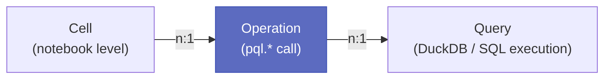
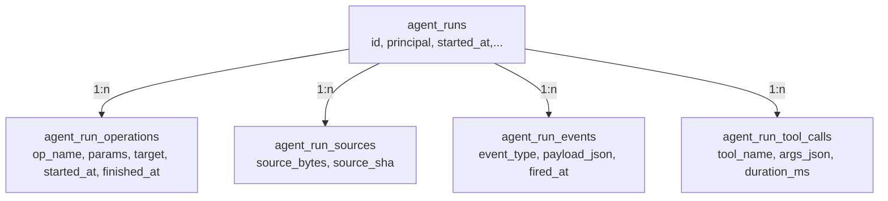
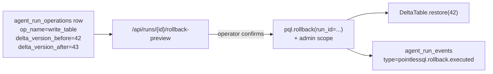

# Audit trail

PointlesSQL's audit trail is **non-bypassable**. Every PQL
write-side primitive (`write_table`, `merge`, `aggregate`,
`rollback`, `branch.promote`) goes through a `record_operation`
context manager that writes a row into `agent_run_operations`
*before* the work happens and updates it on success or failure.
You cannot call a write primitive without leaving an audit row.

This page explains the schema, the forced-audit pattern, and
how three levels (cells / operations / queries) chain together.

## The three levels



| Level | Granularity | Table | Used by |
|---|---|---|---|
| **Cell** | One notebook cell of authored code | `notebook_cell_runs` | Human-authored notebooks; not used by Hermes agents |
| **Operation** | One `pql.*` call (write_table, merge, etc.) | `agent_run_operations` | **Both** humans and agents |
| **Query** | One DuckDB SQL execution | `query_history` | Read paths; tied to the run via `agent_run_id` |

For agent-authored code, the operation level is the unit of
supervision — agents write plain `.py` (no notebook structure),
but every `pql.*` call still produces an op-row.

## The agent_runs container



The `agent_runs` row is created when a Python process opens a
`PQL` instance. Five tables hang off it:

- **`agent_run_operations`** — one row per write-side `pql.*`
 call. The audit centerpiece.
- **`agent_run_sources`** — the agent-authored Python source
 bytes (one row per cell), so audits replay against the exact
 bytes the agent ran.
- **`agent_run_events`** — CloudEvents-shaped log of side
 effects (rollback executed, model promoted, branch promoted).
- **`agent_run_tool_calls`** — every tool call the agent made
 (Hermes plugin tool name + args + duration).
- **`agent_runs_rollback`** — recorded when an admin rolls back
 one of this run's operations.

Every table carries `agent_run_id` as a foreign key with cascade
delete.

## The agent_run_operations row

The most important table. Schema (from
[`pointlessql/models/agent_run_audit.py`](https://github.com/FloHofstetter/PointlesSQL/blob/main/pointlessql/models/agent_run_audit.py)):

| Column | Type | Notes |
|---|---|---|
| `id` | int PK | autoincrement |
| `agent_run_id` | str FK | link back to the run |
| `ordinal` | int | per-run sequence number, 1, 2, 3, … |
| `op_name` | str | `write_table`, `merge`, `aggregate`, `rollback`, `branch_promote`, `train_model` |
| `params_json` | text | the full call arguments serialised |
| `target_table` | str? | three-part UC name when applicable |
| `input_sha` | str? | hash of input data (for replay determinism) |
| `rows_affected` | int? | for write_table, merge, aggregate |
| `delta_version_before` | bigint? | Delta version at op-start |
| `delta_version_after` | bigint? | Delta version at op-end |
| `started_at` | datetime | op-start timestamp |
| `finished_at` | datetime? | op-end timestamp; null = in-flight |
| `error_message` | text? | populated on failure |
| `mlflow_run_id` | str? | cross-link to MLflow when the op is `train_model` |
| `training_params_json` | text? | hyperparameters + metrics blob |
| `env_snapshot` | text? | hardware + library fingerprint |

The schema is **append-only** in normal operation.
`finished_at` and `error_message` get UPDATEd; nothing else.

## The forced-audit pattern

Every write-side primitive is implemented as:

```python
def write_table(df, target, mode="overwrite",...):
 with record_operation(
 factory,
 agent_run_id=resolve_run_id(),
 op_name="write_table",
 params={"target": target, "mode": mode,...},
 target_table=target,
 ) as op:
 #... actual Delta write happens here...
 op.rows_affected = len(df)
 op.delta_version_after = dt.version()
```

The `record_operation` context manager:

1. **Acquires an ordinal** for the run (atomic; survives parallel
 writers).
2. **INSERTs** the row with `started_at = now()` and
 `finished_at = NULL`.
3. **Yields** an `op` object that the caller mutates with
 per-op metadata.
4. **On exit**, UPDATEs `finished_at` (always), and
 `error_message` if an exception escaped.

If the body raises before COMMIT, the row stays with
`finished_at IS NULL` and `error_message` populated. The
[Audit Cockpit](../e2e-walkthroughs/admin-audit.md) renders these
"in-flight or crashed" rows distinctly.

The pattern is enforced by code review, not by language —
there is no decorator that "blocks" calling Delta directly.
But every PQL primitive uses it, and the e2e tests verify the
op-row count after each write.

## What lives in `params_json`

Every public PQL primitive serialises its arguments into
`params_json` so the audit row is self-describing. Examples:

```json
// op_name = "write_table"
{
 "target": "demo.gold.daily_summary",
 "mode": "overwrite",
 "df_columns": ["date", "total", "count"],
 "df_rows": 365,
 "source_table_fqn": "demo.silver.events",
 "source_model_uri": null
}

// op_name = "merge"
{
 "target": "demo.silver.dim_customer_scd2",
 "key": ["customer_id"],
 "source_query": "SELECT * FROM demo.bronze.customers_raw",
 "track_value_changes": true,
 "track_rejects": true
}

// op_name = "train_model"
{
 "framework": "sklearn",
 "experiment_name": "churn_classifier"
}
// + training_params_json carries:
{
 "params": {"learning_rate": "0.01", "n_estimators": "100"},
 "metrics": {"accuracy": 0.92, "f1": 0.88}
}
```

## audit additions

| Column | Phase | Purpose |
|---|---|---|
| `mlflow_run_id` (on `agent_runs` + `agent_run_operations`) | 21.2 | Cross-link the agent run to its MLflow run via `_pql_link` JSON marker |
| `training_params_json` | 21.3 | Forced autolog wrapping `mlflow.autolog()` — captures every hyperparameter + metric |
| `env_snapshot` | 21.4 | Hardware + library fingerprint cached at module-import time (importlib.metadata is slow) |
| `lineage_row_edges.source_model_uri` | 21.7 | Inference attribution: every prediction-table write tags the source model URI |

These four additions turn the data-engineering audit
into a **model-training audit** that captures hyperparameters,
metrics, library versions, hardware, and the inference lineage
back to the predictions a model produced.

## The rollback action loop

The audit trail isn't just observational — it has an action
loop. 's `pql.rollback` reads the op-row and asks
deltalake to restore the table to `delta_version_before`:



The rollback is **fail-loud**: if the table has been written to
since (so `delta_version_after` is no longer the current
version), `pql.rollback` raises `RollbackError` rather than
silently overwriting newer data.

## Cells vs operations for agent-authored code

A subtle but important distinction:

- **Human-authored notebooks** track at the cell level —
 every cell run is one row in `notebook_cell_runs`. The cell
 contains arbitrary Python; one cell may produce zero, one, or
 many op-rows.
- **Agent-authored code** doesn't have cells at all (agents
 write plain `.py`). Supervision granularity for agents
 *is* the operation — the unit a supervisor approves, denies,
 or rolls back is one `agent_run_operations` row.

If you're authoring a daily ETL by hand, the cell view in the
notebook editor is your primary surface. If you're reviewing an
agent's overnight run, the operation view in the run-detail
page is your primary surface. Both views chain back to the same
`agent_runs` row.

## Read paths: query_history

The op-row covers writes. For reads, added
`query_history` — every DuckDB SQL execution gets a row with
`agent_run_id`, `query_text`, `started_at`, `rows_returned`,
`error_message`.

Why both? Because reads can leak as much as writes (an agent
running `SELECT * FROM finance.salary` is a security-relevant
event even though it doesn't change state). The auditor scope
on the API key (see [Auth](auth.md)) gates access to the
`query_history` API for compliance bots.

## What you can do with this trail

Operator answers in <30 seconds:

- **"What did agent X do yesterday?"** —
 `agent_runs WHERE agent_id=X AND started_at > YESTERDAY`
- **"Which runs touched table Y?"** —
 `agent_run_operations WHERE target_table=Y`
- **"What broke run Z?"** —
 `agent_run_operations WHERE agent_run_id=Z AND error_message IS NOT NULL`
- **"Show me yesterday's anomalies"** — the daily Audit-Reviewer
 bot reads the digest API and posts a summary
- **"Roll back run Z's write to gold.daily_summary"** —
 `pql.rollback(run_id=Z)` + admin confirmation

The Audit Cockpit's
[admin-audit walkthrough](../e2e-walkthroughs/admin-audit.md)
demonstrates each query end-to-end.

## Limitations

- **No prompt-bytes.** PointlesSQL records *what* the agent
 did (the op-rows + tool-calls). It does not record the LLM
 prompts, reasoning tokens, or the iteration content. That's
 the [shoreguard Provenance Log's](https://github.com/FloHofstetter/shoreguard-fresh)
 job; PointlesSQL cross-references it via an opaque
 `iteration_id` only.
- **No per-row diff for non-Delta sources.** Row-level lineage
 requires a Delta CDF read. CSV / Parquet inputs without CDC
 hash to a single `input_sha` instead.
- **Eventual consistency under parallel writers.** Two agent
 runs hitting the same table contend on Delta's optimistic
 lock; the audit rows survive but `delta_version_after` may not
 match `delta_version_before` of the second writer.

## Where to read next

- [Lineage](lineage.md) — the row → column → value → inference
 chain that hangs off `agent_run_operations`
- [Agent supervision](agent-supervision.md) — how operators
 consume the audit trail at scale (Family A/B/C tiers, the four
 daily bots, the agent_reviews table)
- [Architecture](architecture.md) — the surrounding system
- [Run-detail walkthrough](../e2e-walkthroughs/agent-ml-registry.md)
 — the UI surface
- [Admin-audit walkthrough](../e2e-walkthroughs/admin-audit.md)
 — Audit Cockpit operator flow
