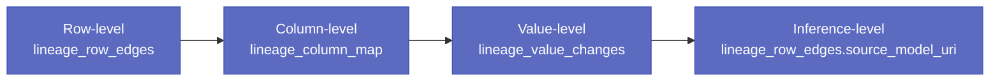
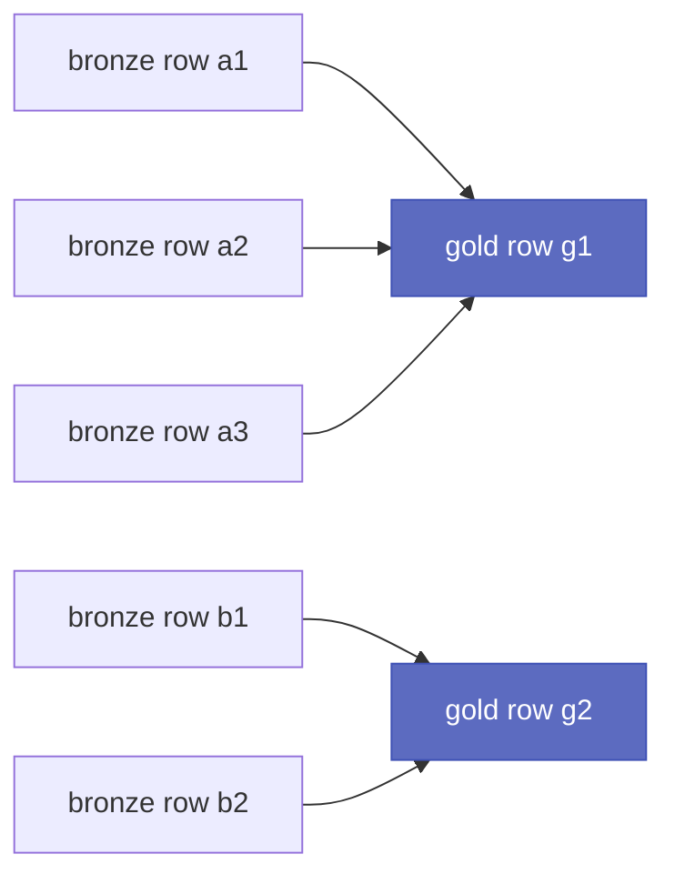

# Lineage

PointlesSQL captures four levels of lineage, **chained through
one DAG**. Each level is its own table; each is opt-in higher-
cost than the level below. An auditor looking at a suspicious
gold-table row can drill all the way back to the model that
produced a prediction, the values that contributed, and the
columns and rows in the source they came from — without
leaving the UI.



## The four levels

| Level | Phase | Cost | Always-on? | Backing table |
|---|---|---|---|---|
| **Row** | 15 | low (one row per row) | ✅ on every `pql.write_table` / `pql.merge` | `lineage_row_edges` |
| **Column** | 15.6 | low (one row per column-pair) | ✅ when the SQL is parseable by sqlglot | `lineage_column_map` |
| **Value** | 15.7 | medium (CDF read) | opt-in via `track_value_changes=True` | `lineage_value_changes` |
| **Inference** | 21.7 | trivial (one URI string) | opt-in via `source_model_uri="models:/.../n"` | `lineage_row_edges.source_model_uri` column |

## Row-level

The grain is one row in source mapped to one row in target. The
`lineage_row_edges` schema is intentionally narrow:

| Column | Type | Notes |
|---|---|---|
| `id` | int PK | |
| `run_id` | str FK | the agent run that produced the edge |
| `op_id` | int FK | the operation row that produced the edge |
| `source_table_fqn` | str | three-part UC name |
| `source_row_id` | str | hash of source row (singular column name; not `*_ids`) |
| `target_table_fqn` | str | three-part UC name |
| `target_row_id` | str | hash of target row |
| `edge_kind` | str | `direct`, `aggregate`, `merge_match`, `merge_insert` |
| `source_model_uri` | str? | inference attribution |

Every row carries an `_lineage_row_id` synthetic column at the
storage level — a deterministic hash that survives
re-writes.

The [row-trace UI](../e2e-walkthroughs/inference-lineage.md)
surfaces this as: click any row in any table → see every
source row in any upstream table that contributed.

## Column-level

When the source-to-target transform is a SQL statement,
PointlesSQL parses it with `sqlglot` and records column
provenance:

```sql
INSERT INTO demo.gold.summary
SELECT date, SUM(amount) AS total
FROM demo.silver.events
GROUP BY date
```

produces three `lineage_column_map` rows:

| target_table | target_col | source_table | source_col | transform |
|---|---|---|---|---|
| demo.gold.summary | date | demo.silver.events | date | direct |
| demo.gold.summary | total | demo.silver.events | amount | aggregate(SUM) |

If sqlglot can't parse the SQL (e.g. agent uses a non-standard
DuckDB function), the row falls back to row-level only. Best-
effort throughout — never a hard error.

## Value-level

For mutations of existing rows (the merge / SCD-2 case), value-
level lineage records the *exact before/after value of every
changed column*. Implementation reads the Delta CDF
(`DeltaTable.load_cdf()`) on the next write.

```python
pql.merge("demo.silver.dim_customer", df,
 key=["customer_id"],
 track_value_changes=True) # opt-in
```

`lineage_value_changes` schema:

| Column | Type | Notes |
|---|---|---|
| `id` | int PK | |
| `run_id` | str FK | |
| `op_id` | int FK | |
| `target_table_fqn` | str | |
| `target_row_id` | str | links to the row-edge row |
| `column_name` | str | |
| `value_before` | text? | masked per `pii_modes` setting |
| `value_after` | text? | masked per `pii_modes` setting |
| `changed_at` | datetime | |

PII-aware: the `value_before` / `value_after` columns are
masked according to the
[PII modes](pii-modes.md) configuration. Default is
`hash_only`.

## Inference-level

When the source of a write is a *model prediction* rather than
another table, the agent passes `source_model_uri`:

```python
pql.write_table(predictions, "demo.gold.preds_v3",
 source_model_uri="models:/demo.fraud.classifier/2")
```

Every `lineage_row_edges` row produced by this write carries the
URI in its `source_model_uri` column. The
[**bidirectional model DAG**](../e2e-walkthroughs/inference-lineage.md)
then renders three node kinds:

- `kind="model"` — the registered model itself
- `kind="table"` — every training-source table found via the
 agent runs that produced the model's versions
- `kind="prediction"` — every table fed by the model

with two edge labels (`trained_from`, `inferred_to`).

## Walking the chain

The chain is **traversable in both directions**:

- **Backward (impact analysis)**: "this gold row looks wrong —
 show me everything that contributed to it"
 → `target_row_id` → upstream `source_row_id`s → their column
 origins → their value diffs → the model URI if any
- **Forward (blast radius)**: "this bronze row was deleted —
 what downstream is affected?"
 → `source_row_id` → downstream `target_row_id`s → all gold
 tables they live in

The walk is recursive: a gold row's source might be a silver row,
whose source is a bronze row, whose source is a CSV file with
`_lineage_row_id` baked in. The
[`pql.aggregate()`](../e2e-walkthroughs/agent-ml-registry.md)
primitive was added specifically because pure
row-level fan-in (n source rows → 1 target row) wasn't
representable as a single edge before.

## Aggregate fan-in



`pql.aggregate("gold.summary", df, group_by=["date"],
source_table_fqn="silver.events")` writes one
`lineage_row_edges` row per (source row, target row) pair, with
`edge_kind="aggregate"`. The walk-back tree walks all source
rows that contributed to a single target row.

## Rejects

When `pql.merge(track_rejects=True)`, source rows that fail the
merge condition (e.g. type mismatch, missing key) land in
`lineage_row_rejects` instead of being silently dropped:

| target_table | source_row_id | reject_reason | row_payload |

The Run-detail page's **Rejects tab** renders this.
Auditors can answer "why didn't this customer end up in the
dim table?" without re-running the merge.

## Limitations

- **External writes are detected, not parsed.** 
 added external-write detection: a `pql.write_table` outside an
 agent-run context still records an op-row with
 `agent_run_id="external"`. But the lineage of an external
 write is whatever the writer claimed — PointlesSQL doesn't
 parse a third-party Spark job to extract column provenance.
- **Per-version inference lineage** is not split — currently
 aggregates at the registered-model level, not per-version.
 + candidate.
- **Row-id collisions** are vanishingly unlikely (32-byte
 blake2 hash of the row payload) but theoretically possible.
- **CDF reads are eventual.** Value-level lineage tracks the
 CDF *after* the merge commits. A reader looking at the table
 immediately after a merge sees the new state but not the
 diff for ~ms until the CDF read finishes.

## Where to read next

- [Audit trail](audit-trail.md) — the `agent_run_operations`
 rows lineage hangs off
- [Time travel walkthrough](../e2e-walkthroughs/time-travel.md)
 — admin-gated read at any past Delta version
- [Rollback walkthrough](../e2e-walkthroughs/rollback.md) — the
 action loop on top of lineage + Delta versions
- [Inference-lineage walkthrough](../e2e-walkthroughs/inference-lineage.md)
 — the bidirectional model DAG end-to-end
- [PII modes](pii-modes.md) — value-level masking
