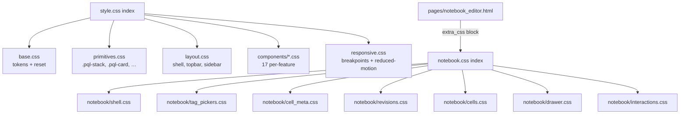
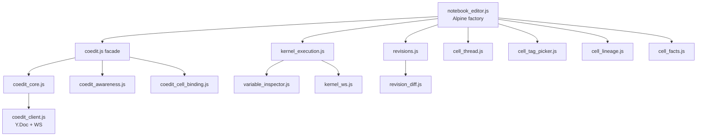

# Frontend architecture

PointlesSQL ships a server-rendered frontend with **no build step**:
Jinja2 templates rendered by FastAPI, dressed with Bootstrap 5.3,
made reactive with Alpine.js, swapped server-side with HTMX, and
glued with native ES modules wired through an `<importmap>`.

Code-as-deployed equals code-on-disk: `git blame` reads cleanly,
there are no source maps, and DevTools shows the same file the
editor sees. The trade-off is one extra HTTP round-trip per
`<script>` / `@import` on cold cache; HTTP/2 multiplexes them
harmlessly.

For a quick orientation, see also:

- [Design tokens](design-tokens.md) — the `--pql-*` token catalog
- [Frontend conventions](frontend-conventions.md) — template/JS/CSS
  layout disciplines
- [`frontend/js/README.md`](https://github.com/FloHofstetter/PointlesSQL/blob/main/frontend/js/README.md) — JS module
  conventions
- [`frontend/templates/_macros/README.md`](https://github.com/FloHofstetter/PointlesSQL/blob/main/frontend/templates/_macros/README.md) —
  Jinja macro catalog

## Stack

| Layer        | Choice                          | Why                                                         |
| ------------ | ------------------------------- | ----------------------------------------------------------- |
| Templates    | Jinja2                          | renders pages + partials, ships state via `\| tojson`        |
| CSS theme    | Bootstrap 5.3 (CDN)             | dark/light themeing, form controls, modal/offcanvas chrome  |
| Reactivity   | Alpine.js (CDN)                 | x-data factories cover the reactivity surface; no vDOM cost |
| Partial swap | HTMX (CDN)                      | server-driven UI without committing to a SPA framework      |
| JS modules   | native ESM via `<importmap>`    | external deps resolve via esm.sh; local files served from `/static/js/` |
| Build        | none                            | dev = prod; no bundler, no transpile                        |

## Directory layout

```
frontend/
├── templates/                  (252 .html files)
│   ├── base.html               # shell + critical init scripts + importmap
│   ├── base_public.html        # unauthenticated variant (auth/error pages)
│   ├── _layouts/               # alternate layouts (auth_chromeless.html today)
│   ├── _macros/                # 14 Jinja macros (badge, button, pagination, …)
│   ├── components/             # shared chrome (sidebars, breadcrumbs, command_palette)
│   ├── pages/
│   │   ├── *.html              # one file per HTTP-visible route
│   │   ├── branch_detail/      # page-scoped subfolder (W4 split target)
│   │   └── _partials/<page>/   # page-scoped fragments (10 subdirs today)
│   └── partials/               # cross-page partials (only when ≥2 pages consume)
│
├── js/                         (149 .js modules, all ESM)
│   ├── bootstrap.js            # entry: import + window-attach
│   ├── api.js, toast.js, …     # top-level utility singletons
│   ├── http.js                 # cookie-CSRF fetch helper (notebook subsystem)
│   ├── base_*.js               # side-effect bridges (htmx, theme, panels, recent)
│   ├── pages/                  # one file per page (or per page-family subfolder)
│   ├── components/             # shared widgets (lineage_dag/, sidebars/, …)
│   ├── notebook/               # large per-feature surface (34 modules)
│   ├── sql_editor/             # large per-feature surface (7 modules)
│   ├── run_view/ table/        # smaller per-feature surfaces
│   └── partials/               # cross-page small fragments
│
└── css/                        (29 .css files, ~4.1K LOC)
    ├── style.css               # master @import cascade index
    ├── base.css                # design tokens (:root + light-mode override)
    ├── primitives.css          # .pql-stack, .pql-cluster, .pql-card, .pql-badge
    ├── layout.css              # shell grid, topbar, sidebar, tree, content
    ├── responsive.css          # breakpoints, touch targets, prefers-reduced-motion
    ├── components/             # 17 per-feature stylesheets
    ├── notebook.css            # lazy-loaded index for notebook editor
    └── notebook/               # 7 sub-files (lazy-loaded with parent)
```

## How a request becomes a page

1. FastAPI route returns `templates.TemplateResponse("pages/foo.html", ctx)`.
2. `pages/foo.html` extends `base.html`, which renders:
   - `style.css` cascade (always)
   - `` for page-lazy CSS (e.g. notebook editor pulls `notebook.css`)
   - `<importmap>` for external ESM deps (CodeMirror, Yjs, etc. via esm.sh)
   - `bootstrap.js` as `<script type="module">`
   - Alpine.js via `<script defer>`
3. `bootstrap.js` imports every factory + side-effect module and
   re-attaches factories to `window.<name>` so templates'
   `x-data="myFactory()"` keep resolving without per-page `<script>` tags.
4. Alpine walks the DOM after `bootstrap.js` finishes (both `defer`
   and `type="module"` are defer-by-default and run in document order).
5. HTMX listens at document-level and intercepts `hx-*` attribute
   requests for partial-swap interactions.

## Bootstrap.js mechanism

`bootstrap.js` is the single entry point that registers everything
templates need. Two attachment patterns coexist:

**Factory pattern** (most common — Alpine x-data):

```javascript
import { feedPage } from './pages/feed.js';
window.feedPage = feedPage;
// Template: <div x-data="feedPage({{ data | tojson }})" x-init="init()">…</div>
```

**Side-effect pattern** (rare — bridges/wirings that just need to run):

```javascript
import './base_htmx_bridge.js';   // hooks htmx:configRequest at module eval
import './base_theme_toggle.js';
import './base_panel_toggles.js';
// Templates need nothing — module runs on import.
```

Page-only utility singletons (`pqlApi`, `pqlToast`, `pqlRelativeTime`)
follow the factory pattern but expose a single object rather than a
constructor:

```javascript
import * as api from './api.js';
window.pqlApi = api;
```

The `scripts/check-frontend-bootstrap-order.sh` pre-commit hook
asserts the importmap → `bootstrap.js` → Alpine load order in
`base.html`. Re-ordering them breaks Alpine's x-data resolve.

## CSS cascade (4 tiers + lazy)

[`style.css`](https://github.com/FloHofstetter/PointlesSQL/blob/main/frontend/css/style.css) `@import`s every other
file in cascade-critical order. Later imports override earlier ones
for the same selector at equal specificity, so refactors that move
rules between files must keep the order stable.

1. **Tier 1 — Tokens & reset** ([`base.css`](https://github.com/FloHofstetter/PointlesSQL/blob/main/frontend/css/base.css))
   - `:root` block with `--pql-*` tokens (spacing, typography, radius,
     elevation, motion, breakpoints, colors, layout sizes)
   - `:root[data-bs-theme="light"]` token overrides
   - `--bs-focus-ring-color` Bootstrap bridge (PointlesSQL accent
     green replaces Bootstrap's default blue ring)
   - `@font-face` for self-hosted Inter (Latin subset, woff2)
   - HTMX View-Transitions cross-fade keyframes
   - Skeleton + badge-pulse keyframes
2. **Tier 2 — Primitives & layout**
   - [`primitives.css`](https://github.com/FloHofstetter/PointlesSQL/blob/main/frontend/css/primitives.css) — `.pql-stack`,
     `.pql-cluster`, `.pql-card`, `.pql-badge`. CSS-only; no JS.
   - [`layout.css`](https://github.com/FloHofstetter/PointlesSQL/blob/main/frontend/css/layout.css) — shell grid,
     topbar, sidebar, tree, content area.
3. **Tier 3 — Per-feature components** ([`components/*.css`](https://github.com/FloHofstetter/PointlesSQL/blob/main/frontend/css/components/))
   - 17 per-feature stylesheets (`icon_rail`, `breadcrumbs`,
     `meta_panel`, `sql_editor`, `feed`, `command_palette`, etc.).
   - One per feature surface; size budget ≤ ~350 LOC each (largest
     today is `icon_rail.css` at 354 LOC).
4. **Tier 4 — Responsive overrides** ([`responsive.css`](https://github.com/FloHofstetter/PointlesSQL/blob/main/frontend/css/responsive.css))
   - 44-px minimum touch targets under `@media (hover: none)`.
   - Blanket `prefers-reduced-motion: reduce` rule that zeroes every
     animation + transition (including third-party CSS that ships
     literal durations like Bootstrap toast fades).

**Lazy-load tier (5)** — A page-only stylesheet is loaded via
`` in the page template, *outside* the
`style.css` cascade. [`notebook.css`](https://github.com/FloHofstetter/PointlesSQL/blob/main/frontend/css/notebook.css)
is the canonical example: 22 LOC index that `@import`s 7
[`notebook/*.css`](https://github.com/FloHofstetter/PointlesSQL/blob/main/frontend/css/notebook/) sub-files (one per
concern axis: shell, tag_pickers, cell_meta, revisions, cells,
drawer, interactions). The browser only fetches the sub-files
when the parent is requested, saving ~800 LOC on every non-notebook
page-load.



The `?v=ASSET_VERSION` query string on every `@import` URL is a
literal — there is no build step that substitutes the actual version.
It exists so a future build step (or a manual templating pass) can
swap in the asset version on every `pyproject.toml` bump and force
sub-file refetch. Browser cache invalidation on the top-level file
already works via the parent template's `?v={{ asset_version }}`
suffix.

## Forward-guard hook

[`scripts/check-no-phase-refs.sh`](https://github.com/FloHofstetter/PointlesSQL/blob/main/scripts/check-no-phase-refs.sh)
is a local pre-commit hook scoped to `frontend/` and `pointlessql/`
(excluding `pointlessql/alembic/versions/`). It greps for
`Phase X.Y` / `Sprint X` / `Wave X` / `BUG-NN-NN` markers in source
comments and user-facing strings. The CLAUDE.md conventions block
documents the rule and its rationale: phase tags read as cryptic
insider language and rot once the project moves past the phase
they reference.

Markdown docs under `docs/` are not in the hook's scope, but new
docs avoid phase refs by style — `a future iteration can…` is
clearer than `Phase X can…` to a reader without project memory.

## Notebook subsystem — deep-dive pointer

The notebook editor is the largest single feature surface: **34 JS
modules + 7 CSS sub-files + a nested template subfolder tree**
(`pages/_partials/notebook_editor/{meta_panel,revisions_panel}/`).
Quick orientation for editing in the subsystem:

- **Coediting (5 modules)** — [`coedit.js`](https://github.com/FloHofstetter/PointlesSQL/blob/main/frontend/js/notebook/coedit.js)
  is the facade that calls three concern-axis installers in order:
  - [`coedit_core.js`](https://github.com/FloHofstetter/PointlesSQL/blob/main/frontend/js/notebook/coedit_core.js) — lifecycle
    (`_initCoedit`, status pill, label/dot/tooltip helpers)
  - [`coedit_awareness.js`](https://github.com/FloHofstetter/PointlesSQL/blob/main/frontend/js/notebook/coedit_awareness.js) —
    Y-protocol awareness, peer-rail rendering, broadcast scheduling
  - [`coedit_cell_binding.js`](https://github.com/FloHofstetter/PointlesSQL/blob/main/frontend/js/notebook/coedit_cell_binding.js) —
    per-cell Y.Text binding, cells_order observer, FLIP-reorder
  - [`coedit_client.js`](https://github.com/FloHofstetter/PointlesSQL/blob/main/frontend/js/notebook/coedit_client.js) is
    the Y.Doc + WebSocket transport (separate from the lifecycle facade).
- **Execution (3 modules)** — [`kernel_execution.js`](https://github.com/FloHofstetter/PointlesSQL/blob/main/frontend/js/notebook/kernel_execution.js)
  (run cells, cancel, content-hash dirty-tracking),
  [`variable_inspector.js`](https://github.com/FloHofstetter/PointlesSQL/blob/main/frontend/js/notebook/variable_inspector.js)
  (snapshot/detail UI), [`kernel_ws.js`](https://github.com/FloHofstetter/PointlesSQL/blob/main/frontend/js/notebook/kernel_ws.js)
  (kernel WebSocket transport).
- **Revisions (2 modules)** — [`revisions.js`](https://github.com/FloHofstetter/PointlesSQL/blob/main/frontend/js/notebook/revisions.js)
  (list + snapshot + pin-as-fact), [`revision_diff.js`](https://github.com/FloHofstetter/PointlesSQL/blob/main/frontend/js/notebook/revision_diff.js)
  (L/R diff selection + unified diff render).
- **Per-cell UI (4 modules)** — [`cell_thread.js`](https://github.com/FloHofstetter/PointlesSQL/blob/main/frontend/js/notebook/cell_thread.js)
  (comments + reactions + reviews + explanations),
  [`cell_tag_picker.js`](https://github.com/FloHofstetter/PointlesSQL/blob/main/frontend/js/notebook/cell_tag_picker.js)
  (per-cell tag picker slice), [`cell_lineage.js`](https://github.com/FloHofstetter/PointlesSQL/blob/main/frontend/js/notebook/cell_lineage.js),
  [`cell_facts.js`](https://github.com/FloHofstetter/PointlesSQL/blob/main/frontend/js/notebook/cell_facts.js).
- **Coordinator** — [`notebook_editor.js`](https://github.com/FloHofstetter/PointlesSQL/blob/main/frontend/js/notebook/notebook_editor.js)
  owns the top-level Alpine factory `notebookEditor()`, instantiates
  the mixin installers, and handles dirty-tracking + save.



The CSS counterpart lives in [`frontend/css/notebook/`](https://github.com/FloHofstetter/PointlesSQL/blob/main/frontend/css/notebook/):
`shell.css` (toolbar + vitals), `tag_pickers.css`, `cell_meta.css`
(author chip + share rows + shared panel skin), `revisions.css`
(diff card + rows), `cells.css` (the largest at 250 LOC — cell
header + editor + markdown + output + empty + history + add-row),
`drawer.css` (right drawer + chat/variables/social + inspector),
`interactions.css` (cell thread + drag-drop + FLIP reorder).
Sub-files are contiguous line-range slices of the pre-W5 monolith,
@imported in original file-order so the cascade is preserved
byte-identical.

## CSRF

PointlesSQL uses two CSRF strategies that coexist for historical
reasons:

- **Meta-tag CSRF** (preferred for new code): `pqlApi.fetch` reads
  `<meta name="csrf-token">` and injects `X-CSRF-Token` on every
  non-GET/HEAD/OPTIONS request. HTMX uses the same source via
  the `htmx:configRequest` hook in
  [`base_htmx_bridge.js`](https://github.com/FloHofstetter/PointlesSQL/blob/main/frontend/js/base_htmx_bridge.js).
- **Cookie CSRF**: [`http.js`](https://github.com/FloHofstetter/PointlesSQL/blob/main/frontend/js/http.js) exports
  `jsonFetch(url, options)`, which reads the `csrftoken` cookie
  (Django/Starlette idiom) and injects `X-CSRFToken`. The notebook
  subsystem (`cell_thread.js`) consumes this helper.

New consumers should pick whichever helper matches the route's
existing CSRF contract. Both helpers handle JSON encoding +
non-OK response routing identically; differ only in the header.
