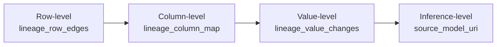

# Concepts at a glance

Read this once and you'll have the mental model for every other
PointlesSQL doc. expands each section into a
dedicated [concept page](../concepts/index.md); this page is the
**ten-minute read** that links the pieces together.

## The four-layer stack

PointlesSQL is one layer of an agent-native lakehouse. It owns
the management plane and the audit record — but not the storage,
not the catalog API, not the agent runtime.

| Layer | Process | Repo |
|---|---|---|
| **Agent runtime** | Hermes / OpenClaw / Claude Code | various |
| **Tool surface** | `hermes-plugin-pointlessql` | [GitHub](https://github.com/FloHofstetter/hermes-plugin-pointlessql) |
| **Management + audit** | **PointlesSQL** (this) | [GitHub](https://github.com/FloHofstetter/PointlesSQL) |
| **Catalog REST** | `soyuz-catalog` (Python UC server) | [GitHub](https://github.com/FloHofstetter/soyuz-catalog) |
| **Storage** | Delta Lake | files / S3 / ADLS / GCS |

Each layer is a separate process. The boundaries are
deliberately thin so the stack stays modular — you can swap any
layer (e.g. point at a different UC server, or skip the agent
plugin entirely) without touching the others.

## Catalogs / schemas / tables

The browse surface is plain Unity Catalog. Names are three-part:

```
demo.sales.orders
└─┬─┘ └─┬─┘ └──┬──┘
catalog schema table
```

Every table is a Delta Lake directory; the UC entry holds
metadata (schema, properties, comments, lineage facets).
PointlesSQL never writes UC rows directly — it goes through the
generated [`soyuz-catalog-client`](https://github.com/FloHofstetter/soyuz-catalog/tree/main/soyuz-catalog-client)
HTTP client.

The [Catalog browser](../e2e-walkthroughs/catalog-browsing.md)
walkthrough is the canonical demo.

## The PQL bridge

`PQL` is the Python-side facade that resolves a UC name to a
Delta path and reads/writes via `deltalake` + `pandas` /
`polars` / `duckdb`. Six primitives:

```python
pql.list_catalogs() # browse
pql.table("demo.sales.orders") # read → DataFrame
pql.read_table_at_version("...", 4) # time-travel
pql.write_table(df, "...", mode=...) # write + audit row
pql.merge("...", df, key=...) # MERGE + lineage
pql.aggregate("...", group_by=...) # fan-in lineage
pql.rollback("...", run_id=...) # one-click revert
pql.branch / pql.discard / pql.promote # Delta-branching
```

Every write-side primitive emits structured audit rows. See
[`pointlessql/pql/pql.py`](https://github.com/FloHofstetter/PointlesSQL/blob/main/pointlessql/pql/pql.py)
for the full surface.

## Agent runs as the audit container

When an agent (or a notebook, or a CLI script) opens a session,
PointlesSQL records an `agent_run` row. Every PQL primitive
called inside that session gets stamped with the run id.

```
agent_runs: one row per agent session
 └─ agent_run_operations: one row per pql.* call
 ├─ training_params_json (, for train_model ops)
 └─ env_snapshot (, hardware fingerprint)
```

The session boundary comes from the `POINTLESSQL_AGENT_RUN_ID`
env var. Hermes sets it per turn (the plugin's
`lifecycle.pre_llm_call` hook); a notebook sets it per-kernel;
a bare CLI inherits one from its parent.

The [Run-detail UI](../e2e-walkthroughs/agent-ml-registry.md)
groups every operation under its run, with a 4-tab breakdown
(Operations / Lineage / Reviews / Source).

## Lineage as a four-level chain



Each level is its own table. Each is opt-in higher-cost than
the level below: row-level is cheap (always on), column-level
runs sqlglot on the SQL when present, value-level loads the
Delta CDF, inference-level just records a model URI string.

**Why it matters**: an audit reviewer looking at a suspicious
report can drill `report row → contributing rows in source →
contributing columns → contributing values → which model
produced this prediction` without leaving the UI. The
[Inference-lineage walkthrough](../e2e-walkthroughs/inference-lineage.md)
demonstrates the full chain.

## The Audit Cockpit

A purpose-built operator surface that aggregates the audit
record into actionable views:

- **Anomaly digest** — yesterday's writes / merges / external
 writes / rejects, with anomaly verdicts (`ok` / `warn` /
 `critical`)
- **Run search + diff** — find runs by agent / table / time;
 diff two runs against each other
- **Latest review** — most recent `agent_review` from the daily
 Audit-Reviewer-Bot
- **Anomaly time-series** — Grafana dashboard at `:3000` (Phase
 19.0 overlay)

See the [admin audit walkthrough](../e2e-walkthroughs/admin-audit.md).

## Agent supervision

Three privilege families:

| Family | Scope | Examples |
|---|---|---|
| **A — Always-on** | Read-only or audit-additive | `pql_list_tables`, `pql_get_run`, `pql_log_training_run` |
| **B — Supervisor-gated** | Mutating + visible decisions | `pql_promote_model`, `pql_rollback`, `pql_post_audit_review` |
| **C — Auditor-only** | Read-only deep audit access | `pql_query_value_changes`, `pql_query_external_writes` |

Family B requires `POINTLESSQL_SUPERVISOR_MODE=1` on the agent
side **and** a supervisor-scoped API key on the server side.
Family C is gated by an `auditor` scope on the API key. The
plugin registers the right tools per family at session start.

The four canonical bot personas (daily Audit-Reviewer,
Compliance-Bot, Incident-Responder, Promotion-gate) are
described in [Hermes jobs](../integrations/hermes-jobs/README.md).

## Delta-branching

Zero-copy branches of UC schemas — local FS uses symlinks, cloud
uses deep-copy with an opt-in cleanup loop. An agent can:

```python
pql.branch("main", "agent-run-123") # symlink local, deep copy cloud
#... agent does its thing, writes to demo.sales.foo on the branch...
pql.promote("agent-run-123") # pointer-swap, hard error on conflict
pql.discard("agent-run-123") # cleanup
```

The hybrid strategy is documented in
[ADR-0003 Delta-branching spike](../decisions/0003-delta-branching-spike.md).

## Champion / challenger model promotion

PointlesSQL does **not** patch the upstream Unity Catalog
proto schema — Databricks-only fields like `aliases` aren't
available. Instead, champion/challenger gets encoded as a
comment-marker convention (`_pql_promotion`) on the model
version. A supervisor-gated `POST /api/models/{name}/promote`
endpoint flips the marker, persists an `agent_review`, and emits
a `pointlessql.model.promoted` CloudEvent for downstream webhook
fan-out.

The [Models promotion walkthrough](../e2e-walkthroughs/models-promotion.md)
shows the flow end-to-end.

## What PointlesSQL is *not*

- **Not a query engine.** DuckDB owns compute (ADR-0002);
 PointlesSQL doesn't reimplement Spark or Photon.
- **Not a Databricks runtime.** No notebooks-as-jobs at
 Spark-cluster scale; the in-process scheduler is for cron-shaped
 Python jobs only.
- **Not an agent framework.** Hermes / OpenClaw / Claude Code
 do that. PointlesSQL is the data + audit substrate they call
 into.
- **Not a vector DB or LLM cache.** Out of scope.
- **Not a hosted SaaS.** You run it. The [installation
 matrix](installation.md) covers Docker, `pip`, and source
 flavours.
