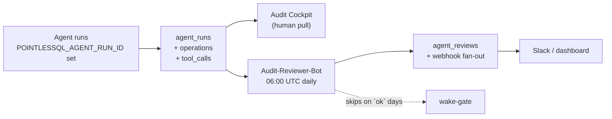

# Agent bring-up

A golden-path tutorial for wiring a brand-new Hermes agent to
PointlesSQL end-to-end.  ~30 minutes.  Chains four e2e
walkthroughs (auth, agent-ml-registry, audit-reviewer-daily,
admin-audit) into a single narrative.

## What you'll have at the end

- A running PointlesSQL stack with the demo catalog seeded
- A Hermes plugin install pointed at it
- Two API keys: one auditor-scoped, one supervisor-scoped
- A daily Audit-Reviewer-Bot cron job firing at 06:00 UTC
- A working agent that can write to a Delta table, log a
  training run, and post a daily review — every action audited
  and replayable

## Prerequisites

- PointlesSQL stack running (see
  [Quickstart](../getting-started/quickstart.md))
- Hermes installed locally
  (`uv pip install hermes-agent` from your sibling clone)
- Python 3.14
- ~30 minutes

## Step 1 — Seed the demo catalog

```bash
cd ~/pointlessql-quickstart
docker compose exec pointlessql uv run python /app/scripts/seed-e2e.py
```

Expected: `seeded demo.sales.customers (20 rows) ... demo.hr.salaries`.

## Step 2 — Register the first user (admin)

Browse to <http://127.0.0.1:8000>, click **Register first admin**,
choose username + password.

Walkthrough: [auth.md](../e2e-walkthroughs/auth.md).

## Step 3 — Mint two API keys

Open a shell:

```bash
docker compose exec pointlessql pointlessql admin issue-auditor-key \
  --name daily-review
# Copy the printed token — it's shown ONCE.
docker compose exec pointlessql pointlessql admin issue-auditor-key \
  --name model-promotion --supervisor
# Copy this token too.
```

The first key is **auditor-only** — it can read the audit
cockpit and post reviews but not flip champions.  The second
adds the **supervisor scope** so the model-promotion agent can
call `pql_promote_model`.

For the rationale see [Permissions](../reference/permissions.md).

## Step 4 — Install the Hermes plugin

In a fresh terminal (outside the docker compose):

```bash
git clone git@github.com:FloHofstetter/hermes-plugin-pointlessql.git \
  ~/git/hermes-plugin-pointlessql   # while it's still private
cd ~/git/hermes-plugin-pointlessql
uv sync
```

Add the plugin to your Hermes config (`~/.hermes/config.toml`):

```toml
[[plugins]]
path = "/home/<you>/git/hermes-plugin-pointlessql/hermes_plugin_pointlessql"
```

Wire the plugin's env knobs in `~/.hermes/.env`:

```bash
POINTLESSQL_BASE_URL=http://127.0.0.1:8000
POINTLESSQL_API_KEY=<auditor-key from step 3>
POINTLESSQL_AUDITOR_MODE=1
# omit POINTLESSQL_SUPERVISOR_MODE for the auditor agent;
# the model-promotion agent gets a separate .env overlay
```

Restart Hermes.  The plugin registers 16 always-on Family-A
tools + 22 Family-C auditor tools = 38 total.  Test:

```bash
hermes --no-llm "list available pql tools"
# Expect: pql_list_catalogs, pql_get_run, pql_audit_summary,
# pql_post_audit_review, ... 38 tools.
```

## Step 5 — Drop in the daily Audit-Reviewer manifest

```bash
mkdir -p ~/.hermes/cron
cp ~/git/PointlesSQL/docs/integrations/hermes-jobs/audit-reviewer-daily.json \
  ~/.hermes/cron/jobs.json   # if jobs.json doesn't exist yet
```

If `jobs.json` already exists, paste the manifest entry into the
top-level array and assign a fresh 12-hex `id`.

Cron fires at `0 6 * * *` (06:00 UTC daily).  Trigger it once now
to confirm:

```bash
hermes cron tick --once --job-id=<id-of-the-manifest>
```

Expected: a markdown digest in the configured Slack channel
**and** a row in `agent_reviews` (visible at
<http://127.0.0.1:8000/admin/audit> on the **Latest review**
card).

Walkthrough: [audit-reviewer-daily.md](../e2e-walkthroughs/audit-reviewer-daily.md).

## Step 6 — Drive a training-and-promotion flow

Spawn a one-shot Hermes agent that:

1. Reads the demo data
2. Trains a sklearn model with `mlflow.autolog()`
3. Logs the training run via `pql_log_training_run`
4. Writes the predictions back tagged with `source_model_uri`
5. Promotes the new version to champion

For the supervisor-scoped agent, use a **second Hermes session**
with these env vars:

```bash
POINTLESSQL_API_KEY=<supervisor-key from step 3>
POINTLESSQL_SUPERVISOR_MODE=1
unset POINTLESSQL_AUDITOR_MODE   # supervisor doesn't need auditor
```

Walkthroughs:
[agent-ml-registry.md](../e2e-walkthroughs/agent-ml-registry.md)
demonstrates the eight-tool flow end-to-end;
[models-promotion.md](../e2e-walkthroughs/models-promotion.md)
shows the champion-flip in detail.

## Step 7 — Verify in the audit cockpit

Browse to <http://127.0.0.1:8000/admin/audit>.

Expected:

- **Anomaly digest** card shows yesterday's writes / merges
- **Latest review** card shows the digest your bot just posted
- **Recent runs** list shows the agent's runs with row-level
  lineage links
- Click any run → **Operations** tab shows the
  `train_model` op with the `training_params_json` accordion
  filled in
- Click any run → **Lineage** tab shows the bidirectional model
  DAG (model → predictions and source tables → model)

Walkthrough: [admin-audit.md](../e2e-walkthroughs/admin-audit.md).

## What you've built

A complete agent-supervision loop:



Adding more agents to this loop is purely additive: each new
agent gets its own API key + plugin install, posts to the same
audit trail, and the daily reviewer summarises across all of
them.

## Troubleshooting

- **Plugin tool list is empty** — `POINTLESSQL_BASE_URL` or
  `POINTLESSQL_API_KEY` not set.  Check `~/.hermes/.env`.
- **Audit-Reviewer fires but writes nothing** — wake-gate
  printed `wakeAgent: false`.  That's the expected
  optimisation on `ok` days.  Force-fire with
  `--ignore-wake-gate`.
- **`pql_promote_model` returns 403** — the API key in the
  current `.env` overlay is auditor-only.  Switch to the
  supervisor key.  See [Permissions](../reference/permissions.md).

## Where to read next

- [Operator cookbook](operator-cookbook.md) — twenty things
  you'll do next
- [Troubleshooting](troubleshooting.md) — fuller list of failure
  modes
- [Hermes jobs index](../integrations/hermes-jobs/README.md) —
  the four canonical bot personas
- [Agent supervision](../concepts/agent-supervision.md) — the
  concept page behind this recipe
