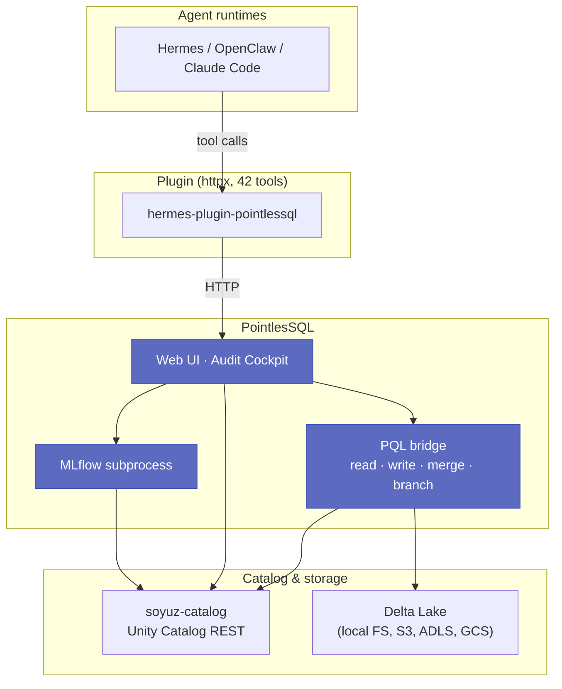

# PointlesSQL

**Databricks-shaped, Python-only, agent-native.**
A web UI and Python bridge over [soyuz-catalog](https://github.com/FloHofstetter/soyuz-catalog)
(Unity-Catalog REST), Delta Lake, and MLflow — with a forced
audit trail every agent action falls into.

[](https://github.com/FloHofstetter/PointlesSQL/blob/main/LICENSE)
[](https://www.python.org/)
[](https://github.com/FloHofstetter/PointlesSQL/blob/main/ROADMAP.md)

## What is PointlesSQL?

A **functional Databricks clone** built from open-source parts.
You bring your own object store and your own agent runtime;
PointlesSQL provides the management plane and the audit
record.  Catalog browsing, Delta read/write, the MLflow registry,
champion/challenger model promotion, row/column/value/inference
lineage, time-travel, rollback, and Delta-branching all live in
one cohesive web app — and every action an agent or operator
takes is captured as a structured audit row that downstream
governance bots can replay.

Think of it as **Rancher for the agent-native lakehouse**:
the SQL warehouse, the model registry, and the supervision
console — one Python process, no JVM, no proprietary control
plane.

## Where PointlesSQL fits



The blue boxes are this repository.  Everything else is a
separate process — `soyuz-catalog` is its own FastAPI server,
Delta Lake is bytes on disk, MLflow runs as a subprocess.
PointlesSQL never imports proprietary code.

## The problem PointlesSQL solves

Letting an agent run free against a Delta lakehouse today:

```python
# Agent code, somewhere in a notebook
import pandas as pd
df = pd.read_parquet("s3://my-bucket/sales/orders/")
df = df[df.amount > 100].assign(reviewed=True)
df.to_parquet("s3://my-bucket/sales/orders_reviewed/")
# Who ran this?  When?  With which prompt?  Which rows changed?
# Where is the audit trail?  Where is the rollback button?
```

PointlesSQL replaces that with a structured surface:

```python
from pointlessql import PQL
pql = PQL()                                    # picks up POINTLESSQL_AGENT_RUN_ID
pql.merge("demo.sales.orders_reviewed", df,    # row-level lineage tagged
          source_table_fqn="demo.sales.orders",
          track_value_changes=True)            # before/after every column
```

Behind the scenes: a row in `agent_run_operations` is written,
every changed cell lands in `lineage_value_changes`, the
operation is replayable via `/runs/<id>` — and a supervisor can
roll the merge back with one click.

## Why PointlesSQL?

| Without PointlesSQL | With PointlesSQL |
|---|---|
| Agent writes go straight to storage, no audit | Forced `record_operation` row per `pql.write_table` / `pql.merge` |
| Lineage is whatever the orchestrator captured | Row-, column-, value-, *and* inference-level lineage as first-class tables |
| "Roll back yesterday's bad ETL" = manual archeology | One-click rollback with preview, Delta-branching for safe replays |
| Model promotion is ad-hoc | Champion/challenger marker grammar with supervisor-gated `pql_promote_model` |
| Agent supervision lives in framework prompts | DB-backed `agent_reviews` + auditor scope + four daily bots |
| Stack is JVM-heavy (Spark, UC server, MLflow JVM) | Python 3.14 only — `pip install` and run |
| Cloud-only or self-host-with-pain | Docker compose pull-and-run, or `pip install` |

## Feature highlights

- **[Native catalog browser](e2e-walkthroughs/catalog-browsing.md)**
  — UC catalogs/schemas/tables/columns with inline edit
- **[Audit Cockpit](e2e-walkthroughs/admin-audit.md)** — search,
  diff, anomaly digest across every agent and operator action
- **[Lineage chain](e2e-walkthroughs/inference-lineage.md)** —
  row → column → value → inference levels chain through one DAG
- **[Champion/challenger ML registry](e2e-walkthroughs/models-promotion.md)**
  — promote model versions through a supervisor-gated marker
  grammar; CloudEvents fire on every flip
- **[Delta-branching](e2e-walkthroughs/branches.md)** —
  zero-copy isolated branches per agent run; promote-with-conflict
  detection
- **[Forced training audit](e2e-walkthroughs/agent-ml-registry.md)**
  — `mlflow.autolog` wrapped to write `train_model` ops with full
  hyperparameter + metric + hardware fingerprint capture
- **[Time travel](e2e-walkthroughs/time-travel.md)** — admin-gated
  read of any past Delta version
- **[Rollback](e2e-walkthroughs/rollback.md)** — one-click revert
  of any agent run with preview + dry-run
- **[Audit-stream forwarder](e2e-walkthroughs/audit-sinks.md)** —
  webhook + S3 + AWS CloudTrail sinks (SigV4-signed)
- **[Hermes plugin (42 tools)](integrations/hermes-jobs/README.md)**
  — agents call PointlesSQL via httpx; supervisor + auditor
  scopes gate sensitive tools

## Quick start

```bash
docker compose pull && docker compose up -d
```

Open <http://127.0.0.1:8000> and register the first user — it
becomes the admin.  See the
[**five-minute quickstart**](getting-started/quickstart.md) for
the full path through "browse catalog → seed sample data → read
a Delta table by name → see the audit row."

For the install flavour matrix (Docker / `pip` / source) head to
the [installation guide](getting-started/installation.md).

## Where to next

| If you want to … | Read … |
|---|---|
| Try it in five minutes | [Quickstart](getting-started/quickstart.md) |
| Understand the mental model | [Concepts overview](getting-started/concepts.md) |
| See a typed list of every operator surface | [Guides](guides/index.md) |
| Read the API surface | [Reference](reference/index.md) (Sprint 22.3) |
| Wire in an agent runtime | [Hermes jobs](integrations/hermes-jobs/README.md) |
| Understand a design decision | [ADRs](decisions/index.md) |

<!-- TODO Sprint 22.5 / launch-sprint:
     replace `https://github.com/...` repo links with
     in-site cross-refs once the docs URL is public. -->
