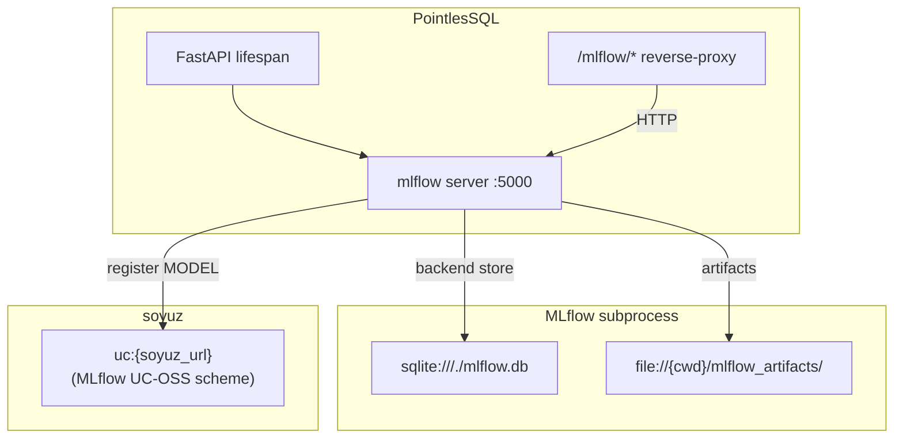

# MLflow

PointlesSQL embeds an [MLflow Tracking](https://mlflow.org/)
server as a subprocess and uses MLflow's UC-OSS registry shape
to expose registered models as a soyuz `MODEL` Securable.
 wired this up end-to-end.

## What runs where



## Key files

| Concern | Path |
|---|---|
| Subprocess lifecycle | [`pointlessql/services/mlflow_subprocess.py`](https://github.com/FloHofstetter/PointlesSQL/blob/main/pointlessql/services/mlflow_subprocess.py) |
| Reverse proxy | [`pointlessql/api/mlflow_proxy.py`](https://github.com/FloHofstetter/PointlesSQL/blob/main/pointlessql/api/mlflow_proxy.py) |
| Forced autolog wrap | [`pointlessql/services/agent_runs/training_context.py`](https://github.com/FloHofstetter/PointlesSQL/blob/main/pointlessql/services/agent_runs/training_context.py) |
| Cross-link bridge | [`pointlessql/services/agent_runs/mlflow_soyuz_link.py`](https://github.com/FloHofstetter/PointlesSQL/blob/main/pointlessql/services/agent_runs/mlflow_soyuz_link.py) |

## audit additions

The MLflow integration is the audit surface for *training* runs
(complementing the existing data-engineering audit):

- **** — subprocess + `/mlflow/` reverse proxy + ML
 tab in the UI
- **** — soyuz `MODEL` Securable with finalize +
 status state-machine
- **** — `agent_runs.mlflow_run_id` cross-link via
 `_pql_link` JSON-marker bridge
- **** — forced autolog: `pql.training_context()`
 wraps `mlflow.autolog()` and writes the
 `agent_run_operations.training_params_json` blob with every
 hyperparameter + metric
- **** — hardware/library fingerprint
 (`agent_run_operations.env_snapshot`) cached at module-import
 time
- **** — Models browse (catalog tree + `/models`
 index + 5-tab detail + cytoscape mini-DAG)
- **** — champion/challenger promotion via
 `_pql_promotion` marker (Aliases aren't in UC-OSS proto)
- **** — inference-lineage:
 `lineage_row_edges.source_model_uri` ties prediction tables
 back to the model that produced them

Closure: see [ closed memory](https://github.com/FloHofstetter/PointlesSQL/blob/main/CHANGELOG.md)
under –21.8 for the full per-sub-sprint detail.

## Configuration

| Variable | Default | Description |
|---|---|---|
| `POINTLESSQL_MLFLOW_ENABLED` | `True` | Master switch. When `False`, the subprocess never starts and the ML tab is hidden. |
| `POINTLESSQL_MLFLOW_PORT` | `5000` | Subprocess listen port. |
| `POINTLESSQL_MLFLOW_BACKEND_STORE_URI` | derived | Defaults to `sqlite:///./mlflow.db`. |
| `POINTLESSQL_MLFLOW_ARTIFACT_ROOT` | derived | Defaults to `file://{cwd}/mlflow_artifacts`. |
| `POINTLESSQL_MLFLOW_REGISTRY_URI` | derived | Defaults to `uc:{soyuz_url}` (MLflow UC-OSS scheme — see 's `uc_oss_proto_diff.md` for why `uc:` not `uc-oss:`). |

Full sub-model in
[`pointlessql/settings.py`](https://github.com/FloHofstetter/PointlesSQL/blob/main/pointlessql/settings.py).

## Optional install

The MLflow dep is in `[project.optional-dependencies] ml`:

```bash
pip install pointlessql[ml]
```

In Docker, the `ml` extra is included in the published image.
For a `pip`-from-git install, add the extra explicitly.

## Lazy spawn

The subprocess starts **on first use** — usually the first time
an HTTP request hits `/mlflow/*` or the first `pql.table()` call
that touches a model URI. Cold-start is ~3-5 s; subsequent
calls are sub-100ms.

## Why subprocess, not import

MLflow has heavy import-time side effects (telemetry, env-var
checks, lazy module loading) that would slow PointlesSQL's
startup by seconds even when MLflow isn't used. Running it as a
subprocess gives:

- ~0 startup cost when MLflow is disabled
- Crash isolation (an MLflow segfault doesn't kill PointlesSQL)
- Independent restart loop (the subprocess can be respawned
 without bouncing PointlesSQL)

## Walkthrough

The full agent-trains-and-promotes flow (eight Hermes plugin
tools, end-to-end):

[Agent ML registry walkthrough](../e2e-walkthroughs/agent-ml-registry.md)

## Where to read next

- [Inference-lineage walkthrough](../e2e-walkthroughs/inference-lineage.md)
- [Models-promotion walkthrough](../e2e-walkthroughs/models-promotion.md)
- [Models-tab walkthrough](../e2e-walkthroughs/models-tab.md)
- [Audit trail → audit additions](../concepts/audit-trail.md#audit-additions)
