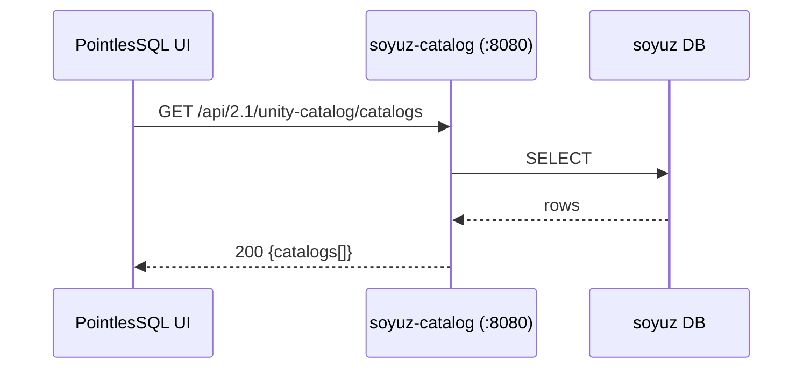

# soyuz-catalog

[soyuz-catalog](https://github.com/FloHofstetter/soyuz-catalog)
is a Python reimplementation of the Unity Catalog REST API,
spec-compatible with the upstream `unitycatalog/unitycatalog`
JVM server and shipping over-the-spec extensions PointlesSQL
relies on.

## What PointlesSQL uses it for

Every catalog / schema / table / column / model entry shown in
the PointlesSQL UI is fetched live from soyuz-catalog over HTTP.
PointlesSQL never writes UC rows directly — it goes through the
generated [`soyuz-catalog-client`](https://github.com/FloHofstetter/soyuz-catalog/tree/main/soyuz-catalog-client)
typed httpx wrapper.

Specific endpoints that matter:

- **Catalogs / schemas / tables / columns** — the entire browse
 surface
- **Lineage facets** (over-the-spec) — soyuz adds `lineage`,
 `column_lineage`, `value_change` facets to UC's table-info
 payload; PointlesSQL emits these on writes via OpenLineage
- **Tags** (over-the-spec) — used for the PII-tag resolver
 ([PII modes](../concepts/pii-modes.md))
- **Effective permissions** (over-the-spec) — used for soyuz
 cross-ref auditing
- **Foreign-catalog federation** (over-the-spec) — Lakehouse
 Federation, exercised by the
 [foreign-catalog-sync walkthrough](../e2e-walkthroughs/foreign-catalog-sync.md)
- **`MODEL` Securable** — registered model type
 PointlesSQL writes through MLflow's UC-OSS registry path

## Pin

The client wheel pin lives in `pyproject.toml`:

```toml
[tool.uv.sources]
soyuz-catalog-client = {
 git = "https://github.com/FloHofstetter/soyuz-catalog",
 tag = "v0.2.0rc5",
 subdirectory = "soyuz-catalog-client",
}
```

`uv sync` fetches the wheel over HTTPS using your shell's git
credentials. No sibling checkout required for normal use.

## Editable escape hatch

When you're iterating on soyuz-catalog itself and want client
regens to surface without a tag bump, swap the pin to a sibling
path:

```bash
bash scripts/use-editable-soyuz.sh # git-tag → editable path
#...iterate...
bash scripts/use-pinned-soyuz.sh # restore pyproject.toml + uv.lock
```

The editable swap leaves `pyproject.toml` dirty on purpose —
that's the signal you're in escape-hatch mode. Don't commit
the swapped file; restore before merging.

## Bug-fix-at-source

When PointlesSQL needs something soyuz doesn't surface yet,
**fix in soyuz**, not with a workaround in PointlesSQL. This
applies to the generated client too — both repos are owned by
the same author and the round-trip is short. See
[`CLAUDE.md` Conventions](https://github.com/FloHofstetter/PointlesSQL/blob/main/CLAUDE.md)
for the rule.

## Process boundary

soyuz-catalog runs as a separate process on `:8080` by default.
Configurable via `POINTLESSQL_SOYUZ_CATALOG_URL` (see
[Configuration](../reference/configuration.md#soyuz-catalog)).



## Where to read next

- [Architecture](../concepts/architecture.md#the-soyuz-catalog-boundary)
- [soyuz-catalog repo](https://github.com/FloHofstetter/soyuz-catalog)
 — README, ROADMAP, ADRs (the soyuz repo has its own ADR-0007
 documenting the generated-client decision)
- [foreign-catalog-sync walkthrough](../e2e-walkthroughs/foreign-catalog-sync.md) —
 Lakehouse Federation in action
