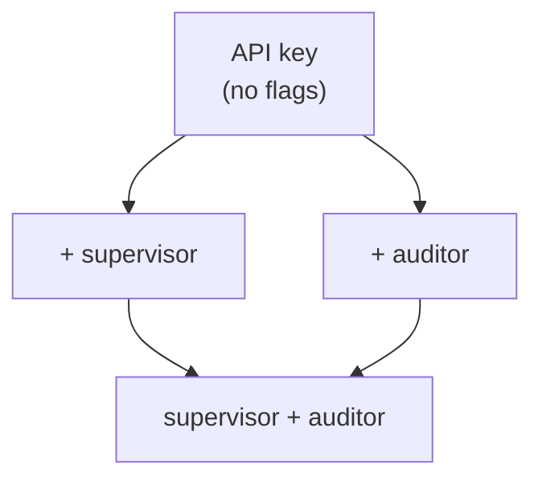

# Permissions

The trust-tier matrix.  Every PointlesSQL endpoint sits at
exactly one row of this table; every API-key has exactly one
column profile.

## The five tiers

| Tier | Identity | Can read | Can mutate | Can do admin actions |
|---|---|---|---|---|
| **Anonymous** | no cookie, no Bearer | `/healthz`, `/metrics` (when allowed) | nothing | nothing |
| **Cookie session** | logged-in human | catalog browse, own runs, dashboards | non-supervisor PQL writes (`/api/pql/write_table`, etc.) | nothing |
| **API key (default)** | Bearer with no scope flags | same as cookie + `/api/pql/*` | same as cookie | nothing |
| **+ supervisor scope** | API key with `supervisor=True` | same as default | mutating decisions: `/api/models/*/promote`, `/api/runs/*/rollback`, `/api/reviews` | nothing |
| **+ auditor scope** | API key with `auditor=True` | full audit cockpit incl. PII (per `pii_mode`), `/api/audit/<axis>`, `/api/lineage/value-changes` | audit-additive writes: `/api/reviews` POST | nothing |
| **Admin user** | cookie session with `is_admin=True` | everything | everything in lower tiers + admin pages | rollback execution, time-travel any-version, `audit_sinks` CRUD, `external-writes` scan |

## Asymmetric ladder

The supervisor / auditor flags are independent extensions of
the API-key tier:

An auditor-only key passes `require_supervisor` for
**audit-additive** writes (`/api/reviews` POST) but **not** for
state mutations (`/api/models/*/promote`).  This split is
deliberate so a daily Audit-Reviewer-Bot can post its review
without being able to flip champions.

## Server-side checks

Every endpoint sits behind one of:

| FastAPI dependency | Tier |
|---|---|
| (no decorator on a public route) | anonymous |
| `_require_auth` | cookie session OR any API key |
| `require_api_key` | API key only (rejects cookie-only) |
| `require_supervisor` | API key with `supervisor=True` |
| `require_auditor` | API key with `auditor=True` (or admin override) |
| `require_admin` | cookie session with `is_admin=True` |

The dependencies live in
[`pointlessql/api/dependencies.py`](https://github.com/FloHofstetter/PointlesSQL/blob/main/pointlessql/api/dependencies.py).

## Plugin-side gating

The Hermes plugin gates **at registration time** so an
unprivileged agent never sees a tool it can't call.  Three
families:

| Family | Env-var gate | Tools |
|---|---|---|
| **A — Always-on** | none | 16 read + audit-additive tools |
| **B — Supervisor** | `POINTLESSQL_SUPERVISOR_MODE=1` | 4 mutating tools |
| **C — Auditor** | `POINTLESSQL_AUDITOR_MODE=1` | 22 deep-audit-read tools |

Even with the env var set, the server-side dependency still
re-checks the API-key scope.  The env-var gate is belt-and-
braces: it stops the LLM from calling something that will
inevitably 403.

See [Agent supervision](../concepts/agent-supervision.md) for
the full design and the four canonical bot personas.

## Admin-only actions

Three actions are admin-only because they're irreversible at
the data level:

1. **Rollback execution** — `/api/runs/<id>/rollback` flips a
   Delta version pointer.  Preview is read-only and available
   to anyone with cookie or auditor; execution is admin-only.
2. **Time-travel reads of arbitrary versions** —
   `/api/lineage/row-at-version?version=N` for any past `N`.
   Default cookie path lets you read the *current* version
   only; admin can read any.
3. **`audit_sinks` CRUD** — `/api/admin/audit-sinks/*`.
   Creating a sink directs PointlesSQL to start sending state
   *out* (webhook / S3 / CloudTrail) — that's a privileged
   action because it shapes downstream audit infrastructure.

## API-key minting

Cookie-session users with `is_admin=True` can mint keys via
the admin UI (`/admin/api-keys`).  The CLI helper
[`pointlessql admin issue-auditor-key`](cli.md#pointlessql-admin-issue-auditor-key)
does the same operation from a shell, useful when bootstrapping
a Hermes cron job before the first browser login.

## Why no per-table ACLs

PointlesSQL deliberately does **not** ship per-catalog or
per-schema ACLs of its own.  Two reasons:

1. **soyuz-catalog already has them.**  Effective-permissions
   over UC's grant graph is a soyuz feature; PointlesSQL
   doesn't second-guess it.
2. **The audit trail is the after-the-fact gate.**  Every
   PQL write produces an op-row.  An incident-responder bot
   with auditor scope can identify "agent X touched table Y
   it shouldn't have" in seconds via
   `/api/audit/principal-summary`.

This is "trust + audit" rather than "deny by default".  It
matches the use-case (autonomous agents that already have
broad capability and need to be supervised) better than fine-
grained allow-lists per (agent, table) pair.

## Where to read next

- [Auth](../concepts/auth.md) — cookie + Bearer mechanics, key
  rotation, env-var seeding
- [Agent supervision](../concepts/agent-supervision.md) —
  Family A/B/C plugin gating + the four bot personas
- [Audit trail](../concepts/audit-trail.md) — what every
  privileged action gets recorded as
- [`pointlessql admin`](cli.md#pointlessql-admin-issue-auditor-key)
  — the one CLI helper for key minting
